Argus Bitumen

# argus

# argusmedia.com

# Europe, Africa, Middle East and Asia-Pacific prices and commentary
Incorporating Argus Asphalt Report

Issue 21-39 | Friday 1 October 2021

# SUMMARY

# Bitumen cargo values gained across Europe and Asia-Pacific,
boosted by a jump in crude and fuel oil values.

# Domestic truck prices across Europe also mostly
strengthened as October started.

Cargo premiums to high-sulphur fuel oil (HSFO) in Rot-
terdam and the Baltics fell by $2-3/t, but outright values
continued to rise, while in the Mediterranean premium
values were steady on the week as refiners held their ground
amid rising outright values and slowing demand.

# The Asia-Pacific bitumen market remained mostly firm,
despite the expected slowdown due to the week-long break
in China for Golden Week holidays.

The continued buoyancy in crude and HSFO prices in the
Asia-Pacific region pushed refiners to either seek price hikes
or mull production cuts at their units. Supply for October
was seen to be balanced in key export export locations like
Singapore and South Korea on the back of lower bitumen
production at some units.

# Demand is expected to improve from Vietnam, Australia,
China and India in the coming weeks supported by seasonal
pick-up or the easing of pandemic-related restrictions.

Bitumen prices shot up across sub-Saharan Africa, with
delivered cargo and drummed import prices racing higher, as
did domestic and export values for South African volumes.

# PRICES

| Bitumen prices at key locations, 25 Sep-1 Oct $/t | Bitumen prices at key locations, 25 Sep-1 Oct $/t | Bitumen prices at key locations, 25 Sep-1 Oct $/t | Bitumen prices at key locations, 25 Sep-1 Oct $/t |  |
| --- | --- | --- | --- | --- |
|  |  | Low | High | ± |
| Export cargo prices fob | Export cargo prices fob | Export cargo prices fob | Export cargo prices fob | Export cargo prices fob |
| Mediterranean | Mediterranean | 448.58 | 453.58 | +20.93 |
| Rotterdam | Rotterdam | 460.90 | 465.90 | +18.95 |
| Baltic | Baltic | 453.90 | 457.90 | +18.95 |
| Singapore | Singapore | 405 | 415 | +5.00 |
| South Korea | South Korea | 395 | 405 | nc |
| Mideast Gulf | Mideast Gulf | 298 | 425 | +5.50 |
| Delivered cargo prices cfr | Delivered cargo prices cfr | Delivered cargo prices cfr | Delivered cargo prices cfr | Delivered cargo prices cfr |
| North Africa | Alexandria, bulk | 486 | 496 | +18.00 |
| East Africa | Mombasa, drum | 465 | 475 | +26.00 |
| West Africa | Lagos, bulk | 600 | 610 | +21.00 |
| East China coast | East China coast | 425 | 475 | +2.50 |
| Domestic prices | Domestic prices | Domestic prices | Domestic prices | Domestic prices |
| Antwerp | ex-works | 490 | 507 | +20.50 |
| Southern Germany | ex-works | 431 | 449 | +8.50 |
| Hungary | ex-works | 443 | 455 | -3.00 |
| Italy | ex-works inc tax | 455 | 466 | -3.00 |
| Indonesia | ex-works | 444 | 444 | -1.00 |
| Mumbai | bulk | 544 | 594 | +17.00 |

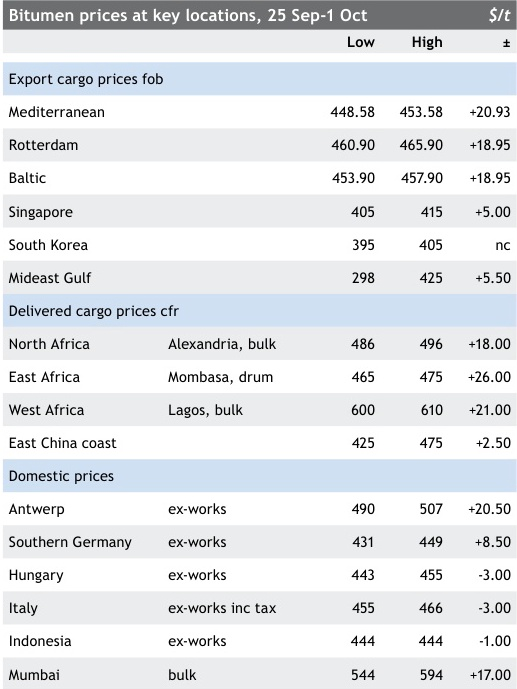

Rotterdam domestic differential to HSFO barges $/t

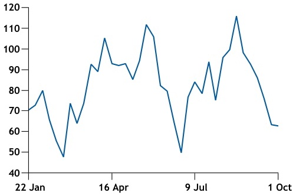
- Chart Type: line
|  | 22 Jan | 16 Apr | 9 Jul | 1 Oct |
| --- | --- | --- | --- | --- |
| item_01 | 78% | 90% | 80% | 70% |

# CONTENTS

| Key bitumen prices | 1 |
| --- | --- |
| Map of waterborne bitumen prices | 2 |
| Northwest and central Europe | 3-5 |
| Mediterranean | 6-8 |
| Sub-Saharan Africa | 9-11 |
| Asia-Pacific and Middle East | 12-17 |
| Vessel tracking indications | 18 |
| Bitumen news | 19-22 |

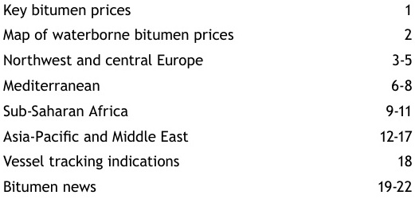

# ■

Copyright Ⓒ 2021 Argus Media group
Licensed to: Shi Jia Lim, Argus Media Limited (London)

Available on the Argus Publications App

Argus Bitumen

Issue 21-39 I Friday 1 October 2021

WATERBORNE BITUMEN PRICES, FOB

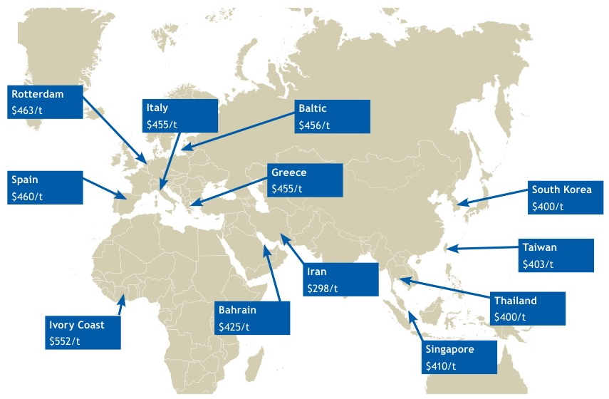
Rotterdam
$463/t Italy Baltic
$455/t $456/t
Greece
Spain
$455/t South Korea
$460/t
$400/t
Taiwan
$403/t
Iran
$298/t
Thailand
Bahrain
$400/t
Ivory Coast $425/t
$552/t
Singapore
$410/t

# CARGO FLOWS

Spanish export cargoes were sent into north African markets
as well as western Europe, although activity was generally
slowing across the Mediterranean.

The 6,118 dwt Ning Hai Wan loaded a cargo from Huelva,
Spain, for discharge into Donges, France, on 29 September,
while the 5,897 dwt Iver Accord loaded a cargo from La Co-
runa, Spain, for discharge into Blaye, France, by 2 October.

The 6,180 dwt Iver Balance loaded a cargo from Cadiz,
Spain, for discharge into Oran, Algeria, on 30 September,
while the 7,066 dwt Herbania loaded a cargo from Huelva for
discharge into Ghazaouet, Algeria, by 29 September.

Waterborne markets, differential to HSFO $/t

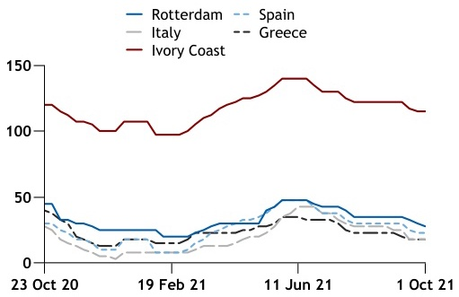
- Chart Type: line
|  | Rotterdam | Spain | Italy | Greece | Ivory Coast |
| --- | --- | --- | --- | --- | --- |
| item_01 | 130 | 110 | 100 | 50 | 30 |

The 6,586 dwt Iver Bitumen loaded a cargo from Huelva
into Tenerife in the Canary Islands on 1 October.

| Europe and Africa cargo export differentials to HSFO | Europe and Africa cargo export differentials to HSFO | Europe and Africa cargo export differentials to HSFO | $/t |
| --- | --- | --- | --- |
|  | Low | High | ± |
| Mediterranean, basis Augusta | +11.33 | +16.33 | +0.33 |
| Rotterdam, Netherlands | +25.00 | +30.00 | -2.50 |
| Baltic | +18.00 | +22.00 | -2.50 |
| Spain | +20.00 | +25.00 | nc |
| Italy | +15.00 | +20.00 | nc |
| Greece | +15.00 | +20.00 | nc |
| Ivory Coast | +113.00 | +117.00 | nc |

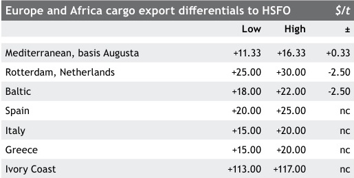

| Europe and Africa cargo export differentials to crude | Europe and Africa cargo export differentials to crude | Europe and Africa cargo export differentials to crude | Europe and Africa cargo export differentials to crude |
| --- | --- | --- | --- |
|  | Differential to Ice Brent $/t | Differential to Ice Brent $/bl | ± |
| Mediterranean, basis Augusta | -143.29 | -5.82 | +0.27 |
| Rotterdam, Netherlands | -130.97 | -3.83 | -0.05 |
| Baltic | -138.47 | -5.04 | -0.05 |
| Spain | -134.62 | -4.42 | +0.22 |
| Italy | -139.62 | -5.231 | +0.21 |
| Greece | -139.62 | -5.23 | +0.21 |
| Albania | -169.62 | -10.09 | +0.22 |
| Ivory Coast | -42.12 | 10.57 | +0.22 |
| Bitumen conversion factor t/bl 6.17 | Ice Brent conversion bl/t 7.53 | Ice Brent conversion bl/t 7.53 | Ice Brent conversion bl/t 7.53 |

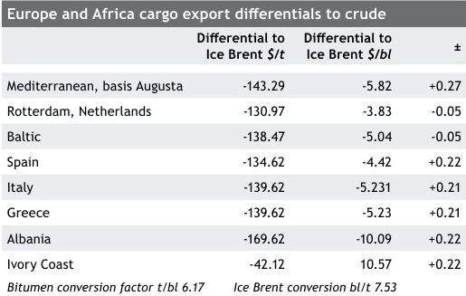

| Copyright Ⓒ 2021 Argus Media group Page 2 of 22 Licensed to: Shi Jia Lim, Argus Media Limited (London) | argus |
| --- | --- |

Argus Bitumen

Issue 21-39 I Friday 1 October 2021

NORTH AND CENTRAL EUROPE MARKET COMMENTARY

# Summary

Domestic truck prices strengthened in several markets,
many of those gains linked to monthly revisions for October
supplies, while cargo prices also jumped.

While German domestic prices were assessed €10/t
firmer after some price erosion caused by plentiful supply
and high stocks being sold off during September, other key
northwest European markets like Benelux, UK and France
registered €20/t, £20/t and €20-25/t gains respectively.
But not all monthly deals between sellers and buyers had
been agreed and confirmed by 1 October, with more details
expected from 4 October.

Czech domestic and export prices also strengthened
on tight refinery supply, although there was still plentiful
availability overall in most central and southeast European
markets.

Sharp gains in fob Rotterdam high-sulphur fuel oil (HSFO)
prices in the last week of September drove up outright
bitumen values, but such gains coupled with early signs of
winter and demand slowdown in parts of the Nordic/Scandi-
navia region encouraged a modest $2-3/t slippage in Rot-
terdam and Baltic cargo export premiums to HSFO that were
assessed at $25-30/t and around $20/t fob respectively.

Cross regional freight rates for standard 5,000t cargoes
were yet to be pushed down significantly, but slim assessed
declines took Thames-bound rates to $22-24/t from Rotter-
dam, $29-31/t from Hamburg, $47-49/t from Klaipeda and
$39-43/t from La Coruna.

UK

Domestic truck prices in the UK were assessed £20/t firmer
at £380-390/t ex-works and £395-405/t delivered after Octo-
ber monthly price hikes that followed hefty crude and fuel
oil gains during September, versus the previous month.

Southern UK domestic and Rotterdam domestic $/t

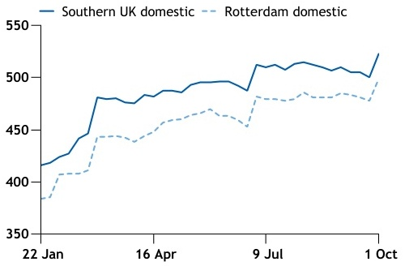
- Chart Title: Southern UK domestic --- Rotterdam domestic
- Chart Type: bar
|  | 22 Jan | 16 Apr | 9 Jul | 1 Oct |
| --- | --- | --- | --- | --- |
| item_01 | 390 | 440 | 500 | 470 |

North and central Europe bitumen prices, 25 Sep-1 Oct

|  | €/t | €/t | €/t | $/t | $/t | $/t |
| --- | --- | --- | --- | --- | --- | --- |
| Low | High | ± | Low | High | ± |  |
| Domestic prices, ex-works | Domestic prices, ex-works | Domestic prices, ex-works | Domestic prices, ex-works | Domestic prices, ex-works | Domestic prices, ex-works | Domestic prices, ex-works |
| Southern UK £/t | 380 | 390 | +20.00 | 516 | 529 | +22.50 |
| Rotterdam, Netherlands | 420 | 435 | +20.00 | 490 | 507 | +20.50 |
| Antwerp, Belgium | 420 | 435 | +20.00 | 490 | 507 | +20.50 |
| Northern Germany | 385 | 395 | +10.00 | 449 | 460 | +8.50 |
| Northeast Germany | 350 | 360 | +10.00 | 408 | 420 | +9.00 |
| Southern Germany | 370 | 385 | +10.00 | 431 | 449 | +8.50 |
| Southwest Germany | 365 | 380 | +10.00 | 425 | 443 | +8.50 |
| Western Germany | 375 | 385 | +10.00 | 437 | 449 | +9.00 |
| Hungary | 380 | 390 | nc | 443 | 455 | -3.00 |
| Romania | 410 | 420 | nc | 478 | 490 | -3.00 |
| Czech Republic | 375 | 385 | +15.00 | 437 | 449 | +14.50 |
| Export prices, ex-works | Export prices, ex-works | Export prices, ex-works | Export prices, ex-works | Export prices, ex-works | Export prices, ex-works | Export prices, ex-works |
| Poland-Germany (truck) | 345 | 355 | +5.00 | 402 | 414 | +3.00 |
| Czech Republic-Germany (truck) | 345 | 355 | +5.00 | 402 | 414 | +3.00 |
| Poland-Romania (truck) | 350 | 360 | nc | 408 | 420 | -3.00 |
| Hungary-Romania (truck) | 390 | 400 | nc | 455 | 466 | -3.00 |
| Rotterdam (cargo) |  |  |  | 460.90 | 465.90 | +18.95 |
| Baltic (cargo) |  |  |  | 453.90 | 457.90 | +18.95 |
| Domestic prices, delivered | Domestic prices, delivered | Domestic prices, delivered | Domestic prices, delivered | Domestic prices, delivered | Domestic prices, delivered | Domestic prices, delivered |
| Southern UK £/t | 395 | 405 | +20.00 | 536 | 550 | +22.20 |
| Brussels | 430 | 445 | +20.00 | 501 | 519 | +20.00 |
| Northern France | 475 | 485 | +20.00 | 554 | 565 | +19.50 |
| Central France | 475 | 485 | +20.00 | 554 | 565 | +19.50 |

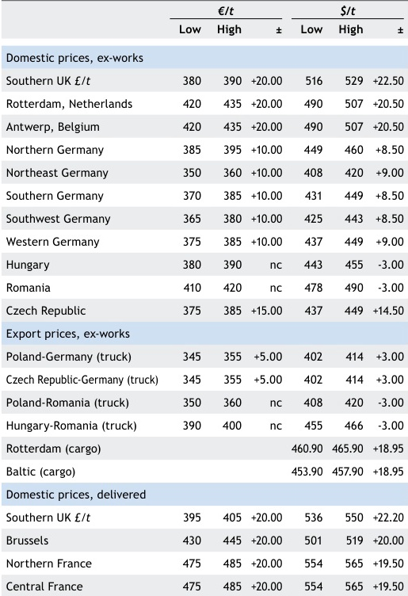

| Crude and refined products, 25 Sep-1 Oct | Crude and refined products, 25 Sep-1 Oct | Crude and refined products, 25 Sep-1 Oct | Crude and refined products, 25 Sep-1 Oct | Crude and refined products, 25 Sep-1 Oct |
| --- | --- | --- | --- | --- |
|  | Low | High | Average | ± |
| Ice Brent minute marker week range $/bl | 78.50 | 79.60 | 78.934 | +3.12 |
| Fuel oil 3.5%S, fob RMG barge $/t | 432.00 | 439.50 | 435.900 | +21.45 |
| Urals cif Rotterdam $/bl | 75.47 | 76.75 |  | +3.69 |
| Fuel oil straight-run 0.5% fob cargo $/t | 566.75 | 584.75 |  | +20.25 |
| Fuel oil straight-run M-100 cif cargo $/t | 472.50 | 479.00 |  | +24.75 |
| Vacuum gasoil 0.5%S cif cargo $/t | 580.25 | 598.25 |  | +20.13 |

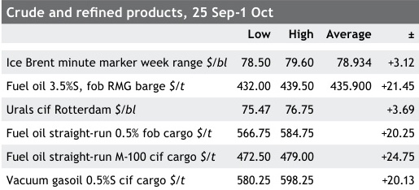

| Northern Europe cargo freight rates | Northern Europe cargo freight rates | Northern Europe cargo freight rates | $/t |
| --- | --- | --- | --- |
|  | Low | High | ± |
| Rotterdam-Thames | 22 | 24 | -0.50 |
| Hamburg-Thames | 29 | 31 | -0.50 |
| Klaipeda-Thames | 47 | 49 | -1.00 |
| La Coruna-Thames | 39 | 43 | -1.00 |

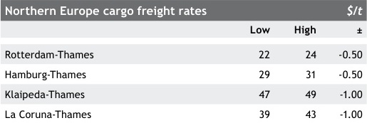

| Copyright Ⓒ 2021 Argus Media group Page 3 of Licensed to: Shi Jia Lim, Argus Media Limited (London) | 22 argus |
| --- | --- |

Argus Bitumen

Issue 21-39 | Friday 1 October 2021

NORTH AND CENTRAL EUROPE MARKET COMMENTARY

The market was also being supported by buoyant levels
of construction work and bitumen requirements throughout
September, with suppliers also pointing to healthy order
books into October and November.

Bitumen availability from domestic refineries and ter-
minals, buoyed by steady cargo import flows, has also been
high, keeping the UK bitumen market broadly balanced.
Cargoes delivered into Thames terminals jumped in in the
last week of September to an indicated $495-500/t (£365-
370/t) cfr range.

UK government data showed domestic bitumen consump-
tion at 156,00t in July, down 6,000t on the same month of
last year. For the May to July period this year consumption
stood at 485,000t, up 59,000t on the same period of 2020.
For year-to-date January to July, UK consumption stood at
1.05mn t, against 817,000t last year, after the negative im-
pact on construction activity and demand in 2020 caused by
Covid-19 lockdowns, particularly from March to May.

# France

French domestic prices rose by €20-25/t, reflecting sharp
gains in agreed prices for the new month of October, al-
though not all supply deal values were yet finalised in discus-
sions between buyers and sellers.

Relatively higher product availability in the north and
centre, as compared with southern France, kept assessed
gains in the former regions to €20/t to reach the €475-485/t
delivered range, while €25/t assessed in the south took
those values to €445-455/t delivered. The partial mainte-
nance shutdown since early-September at the Petroineos
refinery in Lavera on the French Mediterranean coast -
expected to last until early November - was a key factor
behind hefty October price hikes, with some domestic

# Germany: North VS South

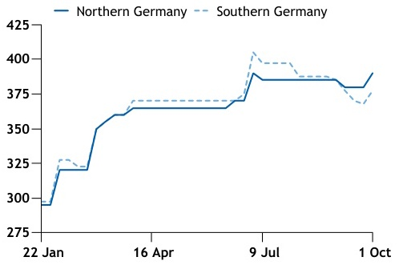
- Chart Title: Southern Germany
- Chart Type: line
|  | 22 Jan | 16 Apr | 9 Jul | 1 Oct |
| --- | --- | --- | --- | --- |
| item_01 | 300 | 350 | 400 | 375 |

suppliers in France seeking monthly price hikes as high as
€30-40/t and in one case as much as €60/t.

The return to normal production and supply from Exxon-
Mobil's Port-Jerome refinery in Normandy, northern France,
was taking longer than anticipated after the plant was hit by
a fire in early September. But both cargo and truck buyers
pointed to a steady improvement in the supply position and
an anticipated return to normal flows after 4 October.

# Benelux

Domestic truck prices in Benelux markets were assessed
€20/t firmer at $420-435/t ex-works, after October price
hikes following crude and fuel oil gains during September.

While some monthly deals appeared to have been com-
pleted, especially in the Netherlands, with price hikes of
around €20/t for October supplies versus September values,
some talks, especially in Belgium, were expected to take
a few more days, with some supplier hikes of up to €40/t
being sought in ongoing negotiations in a bid to make up
for some of the large gains in crude and HSFO prices during
September, pushing up refinery feedstock costs along with a
weakening euro versus dollar.

Local market participants pointed to normal activity
levels for the time of year, with some expecting October to
be the busiest month of the year.

# Germany

Modest price gains were registered on the domestic truck
market, effective from 1 October, after intra-month declines
during September when high stocks held by some refinery
and terminal locations were being sold off.

Domestic demand has also remained below expectations
for the season, underlined by fresh German Bafa data that
showed bitumen deliveries domestically were 211,102t for
July this year, down 17,000t on the same month of 2020. For
the year until July deliveries for Germany domestic con-
sumption were 1.02mn t, compared to 1.07mn t in 2020, a
drop of 4.4pc.

Total refinery production of bitumen was 451,969t in
July, up by 82,359t on the same month of 2020. For the year
until July production stood at 2.19mn t, compared to 1.99mn
t last year, an increase of 10.2pc.

Domestic prices were assessed €10/t up at €385-395/t
ex-works in the north, €350-360/t ex-works in the northeast
and €365-380/t ex-works in the southwest.

# Poland/Czech Republic

Polish demand was significant in the last week of September

Copyright Ⓒ 2021 Argus Media group
Licensed to: Shi Jia Lim, Argus Media Limited (London)

Page 4 of 22

argus

Argus Bitumen

Issue 21-39 | Friday 1 October 2021

NORTH AND CENTRAL EUROPE MARKET COMMENTARY

thanks to better weather encouraging more construction
work, while market participants pointed to higher prices
from refiners in the country with ex-works prices rising for
October supplies as a result of crude gains.

Some market participants also pointed to the poten-
tial for further price increases in Poland through October
as supply from Lotos' Gdansk refinery was expected to be
reduced.

Domestic prices in Poland were indicated as high as
€385/t ex-works, rising sharply by €15-20/t, while Polish
bitumen truck exports to Germany were assessed up €5/t at
€345-355/t ex-works.

Czech exports to Germany were also assessed up €5/t
at €345-355/t ex-works, while Czech domestic prices were
assessed €15/t firmer at €375-385/t ex-works amid limited
availability of some supplies from PKN Orlen subsidiary Uni-
petrol's Litvinov refinery, notably of pen 160/220.

Polish truck exports to Ukraine were indicated at around
€360/t ex-works, with some offers from Germany into Poland
indicated at around €350-360/t ex-works.

# Hungary/Romania/Balkans

Regional domestic and export prices were assessed un-
changed, but market participants expected a steady rise
in demand as well as a hike in some prices, including in
Romania, related to crude and fuel oil gains through the rest
of the month.

Romanian domestic were still assessed at €410-420/t
ex-works, while imports from Poland, which market partici-
pants said were uncompetitive with local Romanian supplies,
were also unchanged at €350-360/t ex-works. More bitu-
men truck loads were sold by a Greek firm to a Romanian
importer in the week ending 1 October as importers in the

# Hungary and Romania domestic

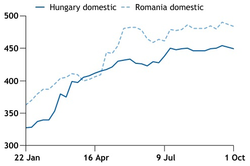
- Chart Type: bar
|  | 22 Jan | 16 Apr | 9 Jul | 1 Oct |
| --- | --- | --- | --- | --- |
| item_01 | 350 | 400 | 475 | 475 |

country gear up for the expected rise in demand following
the release of some funds to constructors, with a ramp up in
demand expected by the end of October to last through until
year end depending on weather conditions in the country.

Vitol's local arm completed an expansion to around
7.000t capacity - from its previous 4,000t - at its Galati
import terminal.

Hungarian domestic truck prices were assessed un-
changed at €380-390/t ex-works, while Hungarian exports to
Romania were assessed unchanged at €390-400/t ex-works
Szazhalombatta. Some exports from Mol's Szazhalombatta
refinery were indicated as low as €340-345/t ex-works into
the Polish market.

Rompetrol's Vega refinery in Ploiesti, Romania, was ex-
pected to ramp up bitumen production following the restart
of the Midia refinery at Navodari around 20 September. The
restart will lead to the resumption of feedstock flows to Ploi-
esti. The 4,999 dwt Sunpower loaded a cargo from Aspropyr-
gos, Greece, for discharge into Mangalia on Romania's Black
Sea coast.

# Baltics

Demand in Latvia was strong with constructors working on
projects in the run up to winter, with bitumen consumption
at healthy levels in the country, according to market partici-
pants, while Lithuanian demand was also steady with a good
rate of bitumen demand.

In Finland however, demand was slowly unwinding with
the onset of snowfall in the north of the country, with
importers looking to future supplies for storage over the
winter.

Fob Baltic cargo premiums to fob Rotterdam HSFO barges
were assessed $2-3/t down at around $20/t to reflect signs of
a slowdown in regional cargo demand.

Posted prices from Orlen's Mazeikiai refinery were up
€10/t, with pen 50/70 and 70/100 at €3980/t ex-works and
pen 100/150 and 160/220 at €405/t ex-works.

The 4,999 dwt Seapower loaded a cargo from St Peters-
burg for discharge into Tallinn on 1 October, while the 6,065
dwt Acacia Rubra moved a cargo from Lomonosov to Pori,
arriving 30 September. The 4,972 dwt Bitonia, its name
changed from the Alcedo that was delivered to Sweden-
based TSA Tanker Shipping in June after the firm purchased
it, moved a cargo from Hamburg to Akureyi, Iceland.

Copyright Ⓒ 2021 Argus Media group
Licensed to: Shi Jia Lim, Argus Media Limited (London)

Page 5 of 22

argus

Argus Bitumen

Issue 21-39 I Friday 1 October 2021

MEDITERRANEAN MARKET COMMENTARY

# Summary

Mediterranean bitumen cargo prices ended September
with sharp gains as high-sulphur fuel oil (HSFO) prices rose
substantially, while bitumen cargo premiums stabilised after
declining for much of the month.

Spanish export premiums to HSFO were assessed un-
changed at $20-25/t fob, Greek fob cargo premiums were
assessed unchanged at $15-20/t, with most Turkish export
flows indicated in the same range, while Italian fob cargo
premiums were also assessed unchanged at $15-20/t. The
impact of a lack of westbound transatlantic arbitrage op-
portunities, as well as a general demand slowdown within
the Mediterranean basin was leading to greater availabilities
across the region.

Delivered values into key north African markets were
falling, with some delivered premium offers in the low
$50's/t into Algerian terminals in October, although most
indications into Algeria and Morocco were still in the high
$50s/t, while delivered Egyptian values for end-October
were also in the same high $50s/t to HSFO delivered area.

The gains in Mediterranean outright values made it yet
more unprofitable to move spot arbitrage cargoes to the US
east, with Spanish fob levels surging to around $460/t fob
during the last week of September, higher than cif US east
coast cargoes that were trading around $450/t.

Egyptian state-refiner EGPC awarded a further 5,000-
6,000t cargo to trading firm BGN at a $57/t delivered pre-
mium, basis Alexandria, for end-October delivery, additional
to the firm's original four-cargo tender awarded to Puma
Energy and 3B Trading.

Cross-Mediterranean freight rates were assessed $1-2/t
down on shorter routes and $2-3/t on the longer routes
amid clear signs of reduced demand for cargoes as well as
tankers to move them. That has led to indications, as the

Italy domestic and Mediterranean HSFO fob cargoes $/t

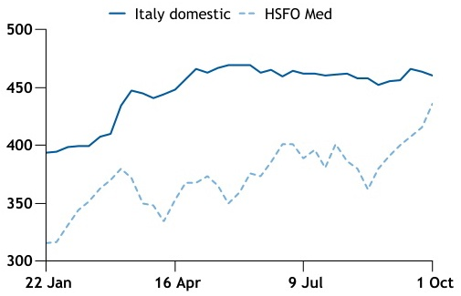
- Chart Type: line
|  | 22 Jan | 16 Apr | 9 Jul | 1 Oct |
| --- | --- | --- | --- | --- |
| item_01 | 315 | 370 | 470 | 410 |

| Mediterranean price index | Mediterranean price index | Mediterranean price index | $/t |
| --- | --- | --- | --- |
|  | Low | High | ± |
| Mediterranean fob (Augusta) | 448.58 | 453.58 | +20.93 |
| Differential to HSFO | +11.33 | +16.33 | +0.33 |

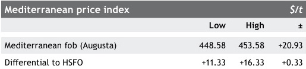

Mediterranean bitumen prices, 25 Sep-1 Oct

|  | Local currency/t | Local currency/t | Local currency/t | $/t | $/t | $/t |
| --- | --- | --- | --- | --- | --- | --- |
| Low | High | ± | Low | High | ± |  |
| Domestic prices, ex-works | Domestic prices, ex-works | Domestic prices, ex-works | Domestic prices, ex-works | Domestic prices, ex-works | Domestic prices, ex-works | Domestic prices, ex-works |
| Italy, including tax | 390 | 400 | nc | 455 | 466 | -3.00 |
| Southern France (delivered) | 445 | 455 | +25.00 | 519 | 530 | +25.50 |
| Northeast Spain | 455 | 465 | nc | 530 | 542 | -4.00 |
| Southwest Spain | 455 | 465 | nc | 530 | 542 | -4.00 |
| Izmit, Turkey | 4,718 | 4,718 | +313.00 | 532 | 532 | +24.00 |
| Izmir, Turkey | 4,718 | 4,718 | +313.00 | 532 | 532 | +24.00 |
| Batman, Turkey | 4,762 | 4,762 | +314.00 | 537 | 537 | +24.00 |
| Kirikkale, Turkey | 4,762 | 4,762 | +314.00 | 537 | 537 | +24.00 |
| Export prices, fob $/t | Differential to HSFO | Differential to HSFO | Differential to HSFO | Differential to HSFO | Differential to HSFO | Differential to HSFO |
| Italy | +15.00 | +20.00 | nc | 452.25 | 457.25 | +20.60 |
| Greece | +15.00 | +20.00 | nc | 452.25 | 457.25 | +20.60 |
| Spain | +20.00 | +25.00 | nc | 457.25 | 462.25 | +20.60 |
| Albania | -15.00 | -10.00 | nc | 422.25 | 427.25 | +20.60 |
| Delivered cargo prices, cfr | Delivered cargo prices, cfr | Delivered cargo prices, cfr | Delivered cargo prices, cfr | Delivered cargo prices, cfr | Delivered cargo prices, cfr | Delivered cargo prices, cfr |
| Alexandria, Egypt | Alexandria, Egypt | Alexandria, Egypt | Alexandria, Egypt | 486 | 496 | +18.00 |
| Gebze-Mersin, Turkey | Gebze-Mersin, Turkey | Gebze-Mersin, Turkey | Gebze-Mersin, Turkey | 480 | 490 | +19.00 |
| Ghazaouet, Algeria | Ghazaouet, Algeria | Ghazaouet, Algeria | Ghazaouet, Algeria | 481 | 491 | +19.00 |
| Rades, Tunisia | Rades, Tunisia | Rades, Tunisia | Rades, Tunisia | 479 | 489 | +19.00 |
| Economics | Economics | Economics | Economics | Mid |  | ± |
| Bitumen's value as a fuel oil blendstock $/t | Bitumen's value as a fuel oil blendstock $/t | Bitumen's value as a fuel oil blendstock $/t | Bitumen's value as a fuel oil blendstock $/t | 395.473 |  | +18.57 |

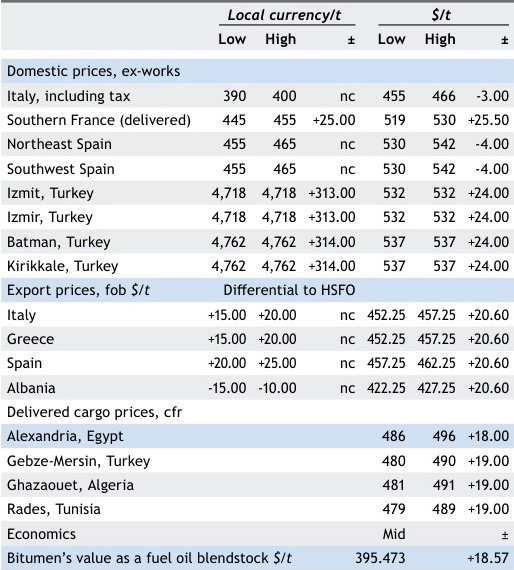

| Crude and refined products, 25 Sep-1 Oct | Crude and refined products, 25 Sep-1 Oct | Crude and refined products, 25 Sep-1 Oct | Crude and refined products, 25 Sep-1 Oct |
| --- | --- | --- | --- |
|  | Low | High | Average ± |
| Fuel oil 3.5% 0.998 fob | 434.00 | 440.25 | 437.250 +20.60 |
| Basrah Light fob Sidi Kerir | 75.32 | 76.40 | +3.62 |
| Urals Med Aframax | 76.12 | 77.20 | +3.62 |
| Iran Heavy fob Sidi Kerir | 71.75 | 72.83 | +3.62 |
| VGO 0.5% west Med cif $/t | 583.75 | 598.25 | +23.63 |

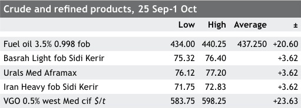

| Mediterranean cargo freight rates | Mediterranean cargo freight rates | Mediterranean cargo freight rates | $/t |
| --- | --- | --- | --- |
|  | Low | High | ± |
| Augusta-Mohammedia | 44 | 47 | -2.50 |
| Tarragona-Mohammedia | 31 | 33 | -1.50 |
| Augusta-Alexandria | 41 | 44 | -2.50 |
| Augusta-Tunis-Rades | 24 | 26 | -1.50 |
| Livorno-Tunis-Rades | 28 | 30 | -1.50 |
| Tarragona-Gazaouet | 25 | 27 | -1.50 |
| Aspropyrgos-Corinth-Agio Theodori-Gebze- Mersin | 29 | 31 | -1.50 |
| Aspropyrgos-Corinth-Agio Theodori-Alexandria | 35 | 37 | -2.50 |

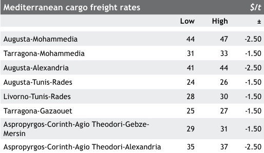

Copyright Ⓒ 2021 Argus Media group
Licensed to: Shi Jia Lim, Argus Media Limited (London)

Page 6 of 22

argus

Argus Bitumen

Issue 21-39 | Friday 1 October 2021

MEDITERRANEAN MARKET COMMENTARY

market enters its usual fourth quarter slowdown period, that
a number of tankers are to become open for spot business
from around 5 October onwards. While vessel waiting and
discharge lengthy delays at Alexandria, Egypt, mean some
tankers are being occupied for longer periods, with Ukraine
port delays anyway a feature of the shipping market this
year, the bearish Mediterranean shipping picture is expected
to cause mounting downward pressures on rates for standard
5,000t movements.

The Augusta-Mohammedia route was assessed $2-3/t
down at $44-47/t, with Augusta-Alexandria and Greece-
Alexandria routes also assessed $2-3/t weaker at $41-44/t
and $35-37/t respectively. On the region's shorter routes,
$1-2/t assessed declines took values to $31-33/t for Tarrago-
na-Mohammedia, $24-26/t for Augusta-Tunisia, $28-30/t for
Livorno-Tunisia, $25-27/t for Tarragona-Ghazaouet and $29-
31/t on Greek ports to Gebze/Mersin, Turkey.

# Algeria/Morocco

Delivered cargo values into north African markets were fall-
ing with indications from market participants for October
delivered cargoes ranging from the low to the high $50s/t
into Algeria and Morocco.

Market participants estimated Algerian bitumen con-
sumption to have been around 65,000t in September, while
they expected a slight increase in bitumen demand for

# Argus Asphalt Annual 2021
now available

# Argus Consulting Services is pleased to present the
Argus Asphalt Annual 2021. The report, now in a new
format, is a comprehensive review of global and country
asphalt/bitumen supply and demand fundamentals.

Our analysis covers 11 regions and 99 countries. The report
covers global, regional and country data for 2016-25. The
report has four years of historical data (2016-19), estimated
data for 2020, and five years of forecast data (2021-25).

Send comments and request more information at
feedback@argusmedia.com

# Petroleum
illuminating the markets

October to 70,000t, as constructors were able to resume
work on a greater number of projects after the release of
some funds after a period over the past two months when
such government disbursements had been well below market
expectations. Local suppliers are now looking ahead to what
they expect to be a fairly busy fourth quarter.

Output from Sonatrach's Arzew refinery was around
400t/day, while some bitutainer volumes were sent from
Arzew to Nouakchott, Mauritania, as well as by truck from
southern Algerian depots to Niger. The firm is expected to
substantially boost its overall bitutainer fleet to around 100
by the end of October to enable it to expand its regional
export business.

Several cargoes were heading into Algerian ports after
a slowdown in the rate of imports in September. The 6,180
dwt Iver Balance loaded a cargo from Cadiz, Spain, for
discharge into Oran on 30 September, while the 8,021 dwt
Poestella loaded a cargo from Augusta, Sicily, for discharge
into Algiers by 2 October.

Th 5,895 dwt The Deputy loaded a cargo from Cadiz,
Spain, for discharge into Mohammedia by 28 October, while
a cargo was expected to be loaded at Port-Jerome, northern
France, in the first 10 days of October for delivery into Djen
Djen.

# Egypt

Egyptian state-owned EGPC awarded an additional cargo
to its original four-cargo award, with the fifth 5,000-6,000t
cargo awarded to trading firm BGN at a $57/t delivered pre-
mium to fob Mediterranean HSFO cargoes, basis Alexandria.

The original tender tender for four 5,000-6,000t cargoes
of pen 60/70 bitumen for mid to late October delivery into
its Alexandria terminal saw two cargoes each awarded to
Puma Energy and BB Energy unit 3B Trading, at values be-
tween $57-58/t to HSFO delivered premiums.

The 5,765 dwt Iver Agile loaded a cargo from Mersin,
Turkey, for 2 October delivery into Alexandria where lengthy
discharge delays have emerged over the past few weeks.

# Spain

Spanish fob cargo premiums to fob Mediterranean HSFO
cargoes were assessed unchanged at $20-25/t, while outright
values were up sharply.

Demand for US east coast cargoes remained weak going
into October with cif US east coast values steady around
$450/t from US east, lower than fob Spain outright price
indications of around $460/t in late-September, keeping the
westbound arbitrage unprofitable.

Copyright Ⓒ 2021 Argus Media group
Licensed to: Shi Jia Lim, Argus Media Limited (London)

Page 7 of 22

argus

Argus Bitumen

Issue 21-39 | Friday 1 October 2021

MEDITERRANEAN MARKET COMMENTARY

Spanish domestic demand remained steady with domes-
tic truck prices assessed unchanged at €455-465/t ex-works
on 1 October with no confirmation yet from sellers or buyers
of finalised monthly prices for October volumes.

The 6,586 dwt Iver Bitumen loaded a cargo from Huelva
for discharge into Tenerife, Canary Islands, arriving 1 Oc-
tober, while the 7,066 dwt Herbania loaded a cargo from
Huelva for discharge into Ghazaouet, Algeria, on 29 Septem-
ber.

The 6,118 dwt Ning Hai Wan loaded a cargo from Huelva
for discharge into Donges, France, on 29 September.

# Italy

Fob cargo premiums to Mediterranean HSFO prices from Ital-
ian export terminals were assessed unchanged at $15-20/t
with greater availability being indicated by some market
participants as regional demand begins to slow down.

Italian domestic demand remained buoyant, but prices
were unchanged going into October, with market partici-
pants anticipating activity and demand to remain steady at
strong levels during much of the fourth quarter.

Strong gains in fuel oil and crude values have been the
main driver of upward revisions of domestic Italian values,
with some market participants anticipating renewed bitu-
men truck price hikes during October as refiners aim to keep
pace with rising crude oil prices.

Domestic truck prices were assessed unchanged in the
week ending 1 October at €390-400/t ex-works, including
the €31/t domestic duty on sales of road paving penetra-
tion grades, while truck export prices into southern France
as well as Switzerland were indicated around €365-375/t
ex-works.

The 6,165 dwt An Hai Wan loaded a cargo from Tarra-
gona, Spain, for discharge into Naples, while the 5,897 dwt
Iver Action loaded a cargo from Augusta for discharge into
the southern French port of Lavera by 2 October.

# Greece

Greek export cargo premiums to fob Mediterranean HSFO
cargoes were assessed unchanged at $15-20/t fob, with
market participants indicating offers within that range for
prompt loadings.

Demand for Greek loading spot cargoes was however thin
amid a general downturn in Mediterranean demand heading
into the fourth quarter, while refiners were highly reluctant
to allow their spot cargoes to be sold at markedly lower val-
ues than those agreed under their annual contractual deals
for 2021 supplies.

Domestic Greek truck prices gained significant ground,
rising €24/t, with ex-works offers from Hellenic Petroleum's
Aspropyrgos and Thessaloniki refineries at €424/t and
€426/t ex-works respectively, while truck sales from Motor
Oil Hellas' Agio Theodori refinery were indicated at €424/t
ex-works. Trucks continued to be sent into the Romanian
market, with a Greek firm sending a further 30 trucks into
the country from its storage tanks at Thessaloniki in antici-
pation of pick up in Romania activity and demand by the end
of October as money begins to reach more constructors in a
rush to complete road projects before winter.

The 4,999 dwt Sunpower loaded a cargo from Aspro-
pyrgos for discharge into Mangalia on Romania's Black Sea
coast. The 37,000 dwt Asphalt Synergy loaded a cargo on 22
September from Agio Theodori and was located near Gibral-
tar on 1 October, with no end destination as yet clear for
its cargo. The 6,065 dwt Fuji Lava was loading a cargo from
Aspropyrgos on 30 September, having previously discharged
a cargo into Nikolaev, Ukraine.

# Turkey

Domestic prices in Turkey continued their recent run of
strength with posted prices at Tupras' refineries surging
TL313-314/t to TL4,718/t ex-works lzmit and Izmir refineries
and to TL4,762/t ex-works Batman and Kirikkale refineries,
with those values effective from 28 September.

The rise in prices is in part a result of higher crude
values and a weakening Turkish Lira, but market participants
also noted a slowdown in imports from Iraqi Kurdistan and
other Iraqi export points, with production lower in part
linked to rising vacuum residue feedstock costs and specifi-
cation issues on some bitumen grades.

Domestic Turkish demand was also picking up pace in
a final rush to complete works by constructors before the
usual winter halt in activity from December.

A second cargo from the Mideast Gulf is expected in the
coming weeks into the Toros Gubre terminal at Ceyhan, with
as yet no clear indication of which tanker is to make that
journey or any firm shipment dates.

Copyright Ⓒ 2021 Argus Media group
Licensed to: Shi Jia Lim, Argus Media Limited (London)

Page 8 of 22

argus

Argus Bitumen

Issue 21-39 I Friday 1 October 2021

SUB-SAHARAN AFRICA MARKET COMMENTARY

# Summary

Bitumen prices shot up across sub-Saharan Africa, with deliv-
ered cargo and drummed import prices racing higher, as did
domestic and export values for South African volumes.

The demand picture was fairly buoyant in several south-
ern and east African markets, while the rainy season was
still keeping a lid on west African activity rates.

# West Africa

Cargo prices for delivery into regional import terminals
surged as a renewed spike in crude and high-sulphur fuel oil
(HSFO) prices drove up outright bitumen values.

Spanish and Ivory Coast cargo premiums to fob Mediter-
ranean HSFO cargoes were assessed unchanged at $20-25/t
and around $115/t fob respectively after recent declines and
amid marked reluctance amongst major European refinery
suppliers to export product at yet lower premiums than
under their existing contractual arrangements for 2021 sales.

Freight rate assessments for standard 5,000t spot cargo
movements from Spanish to Nigerian ports stayed in the
$150-160/t range, but mounting downward pressures on
cross-Mediterranean rates could exert similar pressure on
west Africa-bound and intra-regional freight rates over the
coming weeks.

West African construction activity and bitumen demand
levels remained subdued as rainy season conditions saw no
sign of letting up. The greatest concentration of rainfall
affecting the southern and western parts of the region, prin-
cipally Nigeria, Cameroon, Ivory Coast and Ghana.

The 45,974 dwt Bitu Express arrived at the 36,000t
capacity Rubis deep-water terminal at Lome, Togo, on 26
September with a large cargo loaded at the Agio Theodori
terminal in Greece. The volume helped bolster regional

# Tanzania, cfr Dar es Salaam drums

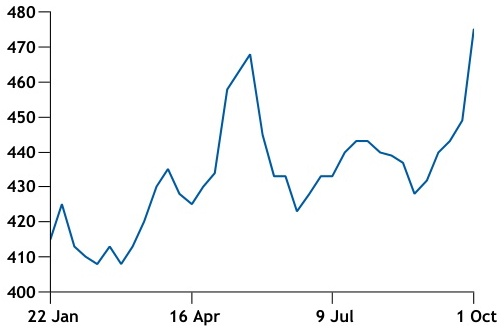
- Chart Type: line
|  | 22 Jan | 26 Apr | 28 Jul | 2 ( 9 Jul) | 3 ( 9 Jul) | 4 ( 10 Jul) |
| --- | --- | --- | --- | --- | --- | --- |
| item_01 | 410Not specified | 410Not specified | 430Not specified | 470Not specified | 430Not specified | 470Not specified |

| Sub-Saharan Africa bitumen prices, 25 Sep-1 Oct |
| --- |
| <table><thead><tr><td rowspan="2"></td><td colspan="2">Local currency/t</td><td colspan="2">$/t</td></tr><tr><td>Low</td><td>High ± Low</td><td>High</td><td>±</td></tr></thead><tbody><tr><td colspan="5">Domestic prices, ex-works</td></tr><tr><td>South Africa</td><td>9,200 9,600 +750.00</td><td>611</td><td>637</td><td>+39.00 $/t</td></tr><tr><td colspan="5">Import/export prices</td></tr><tr><td colspan="2">Ivory Coast, fob Abidjan (export, cargo)</td><td>550.25</td><td>554.25</td><td>+20.60</td></tr><tr><td colspan="2">Nigeria, cfr Lagos (import cargo)</td><td>600</td><td>610</td><td>+21.00</td></tr><tr><td colspan="2">Ghana, cfr Takoradi-Tema (import, cargo)</td><td>576</td><td>586</td><td>+21.00</td></tr><tr><td colspan="2">Kenya, cfr Mombasa (import, drums)</td><td>465</td><td>475</td><td>+26.00</td></tr><tr><td colspan="2">Tanzania, cfr Dar es Salaam (import, drums)</td><td>470</td><td>480</td><td>+26.00</td></tr><tr><td colspan="5">Freight rates</td></tr><tr><td colspan="2">Abidjan-Lagos-Warri-Port Harcourt (cargo)</td><td>41</td><td>45</td><td>$/t nc</td></tr><tr><td colspan="2">Abidjan-Takoradi-Tema (cargo)</td><td>27</td><td>30</td><td>nc</td></tr><tr><td colspan="2">Tarragona-Lagos-Warri-Por Harcourt (cargo)</td><td>150</td><td>160</td><td>nc</td></tr><tr><td colspan="2">Bandar Abbas-Jebel Ali-Mombasa (drums)</td><td>95</td><td>100</td><td>+10.00</td></tr><tr><td colspan="2">Bandar Abbas-Jebel Ali-Dar es Salaam (drums)</td><td>100</td><td>105</td><td>+10.00</td></tr><tr><td colspan="2">Bandar Abbas-Jebel Ali-Djibouti (drums)</td><td>185</td><td>190</td><td>+10.00</td></tr></tbody></table> |
| <table><thead></thead><tbody><tr><td colspan="3">Mideast Gulf to Africa freight rates</td><td>$/t</td></tr><tr><td></td><td>Low</td><td>High</td><td>±</td></tr><tr><td>Bandar Abbas/Jebel Ali-Mombasa (drums)</td><td>95</td><td>100</td><td>+10.00</td></tr><tr><td>Bandar Abbas/Jebel Ali-Dar es Salaam (drums)</td><td>100</td><td>105</td><td>+10.00</td></tr><tr><td>Bandar Abbas/Jebel Ali-Djibouti (drums)</td><td>185</td><td>190</td><td>+10.00</td></tr></tbody></table> |

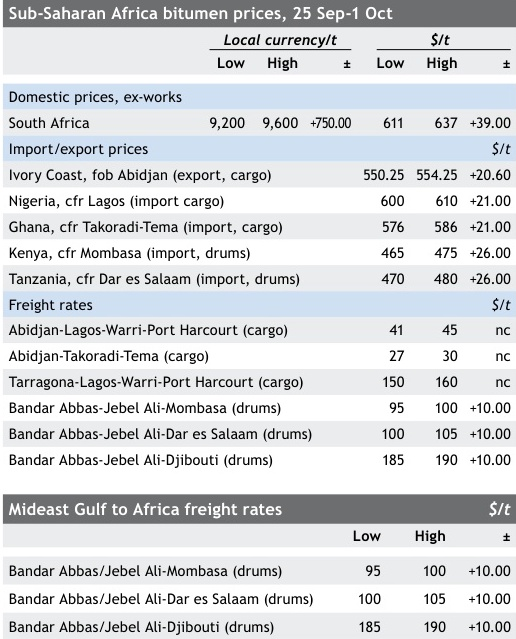

stocks in readiness for the end of the rainy season and the
resumption of dry season road project requirements, ex-
pected in Nigeria to begin from the end of October.

The final destination of the tanker's sister ship - the
45,986 dwt Bitu Atlantic - was so far undisclosed after it
loaded at the Tarragona export terminal in Spain and headed
west to pass Gibraltar on 1 October. The destination could
be either the US or west Africa.

The 9,776 dwt Viveka returned to the Lome terminal
after making a two-port shipment from the Togolese location
into Cape Town and Durban, South Africa.

# Mauritania/Mali/Niger

International container shipping rates showed no sign of
easing after recent hefty gains, but Algerian firm Naftal,
Sonatrach's marketing and supply unit, was at end of Sep-
tember loading a second 300t bitutainer consignment at its
Arzew bitumen plant and terminal for shipment to Nouak-
chott, Mauritania.

The Algerian firm had in July won a tender to supply
10,000t of bitumen to Mauritania, as well as another 3,000t
to Mali. While security fears in Mali mean no near term pros-

Copyright Ⓒ 2021 Argus Media group
Licensed to: Shi Jia Lim, Argus Media Limited (London)

Page 9 of 22

argus

Argus Bitumen

Issue 21-39 | Friday 1 October 2021

SUB-SAHARAN AFRICA MARKET COMMENTARY

pect of any deliveries into that market, Naftal had sent its
first 300t bitutainer volume to Nouakchott for the Maurita-
nian market in late-August, also from Arzew. Naftal, which
is in the process of expanding its fleet of bitutainers build by
an Algerian firm, has also been supplying small-scale bitut-
ainer volumes into Niger from its depots in southern Algeria.

# Nigeria

Nigerian bitumen stocks remained at high levels after a
number of cargo deliveries into its terminals during Septem-
ber at a time of weak demand amid continued and intensive
rainy season conditions.

The latest data released by the country's Petroleum
Products Pricing Regulatory Agency (PPPRA) showed stocks
of the product stood on 30 September at 31,106,384 litres
(31,707t), down slightly from a peak of 31,906,036 litres
(32,523t) on 22 September but still 26pc up from the 1 Sep-
tember level of 24,729,625 litres (25,208t).

The 5,076 dwt Jane Asphalt arrived at the Abidjan ter-
minal in Ivory Coast to load its next cargo for delivery into
Gradient Energy's Warri terminal in Nigeria's Delta State.
All previous cargo shipments on board the tanker into the
Gradient terminal during 2021 have been made from Spanish
export terminals at Huelva, Tarragona and Cadiz, as well as
one February cargo movement from Augusta, Sicily.

The 11,406 dwt Biskra was still located off Port Harcourt
on 29 September, having arrived there on 23 September with
the second of its two-port discharges, the first having been
into Sapele.

# Ghana/Ivory Coast/Cameroon

The prospect of an alternative Ghanaian bulk bitumen im-
porter was pushed back by a few months as local firm GOIL

West Africa cargo cfr- Med HSFO fob cargoes

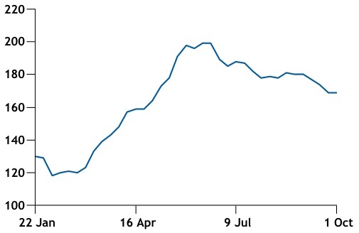
- Chart Type: bar
|  | 22 Jan | 16 Apr | 9 Jul | 1 Oct |
| --- | --- | --- | --- | --- |
| item_01 | 125 | 145 | 200 | 165 |

delayed its 6,00t bitumen terminal project in the Tema port
area.

The $35mn project in a joint venture with Ivory Coast
bitumen producer SMB, also includes a 30t/hour capacity
styrene-butadiene-styrene (SBS) polymer-modified bitumen
(PMB) plant as well as a 60t/hr emulsions unit. The proj-
ect had been slated for end-September completion, but is
now being targeted to be ready at the end of this year (see
news).

Virtually all of Ghana's bulk cargo imports are currently
made into its Takoradi terminal, mainly from SMB's Abidjan
refinery and terminal complex, with Shell and Total receiv-
ing those volumes of AC-10 and AC-20 and selling them to
local truck buyers.

The 4,900 dwt SMB time-chartered San Biagio moved a
cargo from the firm's Abidjan refinery and terminal com-
plex to Douala, Cameroon, arriving there on 29 September.
Armed guards on board was indicated by vessel tracking
services, underlining the continued security risks associated
with shipping movements in the Gulf of Guinea.

# East Africa

Regional import prices for both drummed and bulk bitumen
imports from the Mideast Gulf maintained their upward mo-
mentum amid gains in both fob and delivered prices.

The sharpest gains affected the Iranian drummed export
trade to east African ports, with Iranian exports assessed
$16/t up at $365-380/t fob Bandar Abbas, while freight rates
from Bandar Abbas to Mombasa, Kenya, and Dar es Salaam,
Tanzania, were assessed $10/t up at $95-100/t amid relent-
less gains in container shipping costs caused by global short-
age in that sector.

Market participants reported price indications into Kenya
at values anywhere from $460/t up to the $475-485/t cfr
Mombasa range for direct shipments from Bandar Abbas and
as high as $650-660/t for indirect flows via Jebel Ali.

Regional suppliers said Iranian state-owned IRISL and its
HDS affiliate had raised direct shipping rates from Bandar
Abbas to Mombasa and Dar es Salaam to $1,850-1,950 per
container ($90-100/t), while some east Africa bound move-
ments made indirectly by international container ship-
ping lines were indicated as high as $5,000 per container
($250/t).

Market participants named several such lines that were
offering little or no services on Mideast Gulf to east and
other sub-Saharan Africa routes.

Assessed freight rates from Bandar Abbas to Djibouti
were also $10/t firmer at $185-190/t given that the route can

Copyright Ⓒ 2021 Argus Media group
Licensed to: Shi Jia Lim, Argus Media Limited (London)

Page 10 of 22

argus

Argus Bitumen

Issue 21-39 | Friday 1 October 2021

SUB-SAHARAN AFRICA MARKET COMMENTARY

only be served by international shipping lines moving moves
in directly via UAE ports, principally Jebel Ali.

Iranian bulk cargo exports were assessed $10-11/t up at
$290-305/t fob Bandar Abbas, while Bahraini state-owned re-
finer Bapco announced it would raise its listed cargo export
price by $15/t to $440/t fob Sitra with effect from 2 October
in the wake of two sets of hikes over the past month.

# Kenya/Uganda/South Sudan

Regional suppliers pointed to more busy rates of construc-
tion activity and bitumen requirements in Kenya, Uganda
and South Sudan.

While supply of Iranian drummed bitumen remains tight
amid container shipping and container shortages as well as
regular delays in such shipping movements, especially on Ira-
nian state-owned IRISL vessels, bulk cargo supply movements
have helped to alleviate some of the availability issues in
east African markets.

The 3,764 dwt R Ocean was set to deliver its bulk cargo
into the Skytrade Global terminal in Mombasa after its
scheduled 10 October arrival with its cargo loaded in the
Mideast Gulf, following the previous 30 August delivery
on the same tanker. While nearly all the volumes in the
previous shipment have already been delivered to local and
regional buyers, around half of the new shipment's volume
was understood to have already been pre-sold by the week
ending 1 October.

Domestic drummed and bulk truck prices were expected
to face upward pressure because of the spike in delivered
values into Mombasa, Kenya. Bulk truck volumes were
indicated at Kenyan Shillings 71-73/kg ($642-660/t) ex-works
Mombasa, while drummed sales were at KES73-74/kg ($660-
669/t) and expected to rise in early October to as high as
KES75/kg ($679/t).

# Southern Africa

New: Quick access to price history and charts
Dear Argus customer,

South African domestic and truck export prices jumped,
with some of the export flows now indicated at around Rand
8,300/t ($550-560/t) ex-works.

If you have a subscription to the online Argus Direct
service, you now have quick access to a view of price
history direct from this PDF.
Click on a price series value, and provided you are con-
nected to the internet, you will be taken directly to the
price series on Argus Direct in your browser, where you
can view and chart the history.
In advanced PDF viewers, you can also hover over the
price to see the underlying Argus PA code.

A steady stream of requirements was reported into Zam-
bia, Malawi and Botswana, with drummed flows also heading
into Zimbabwe from neighbouring South Africa.

# South Africa

Domestic truck prices shot up as South African refiners dra-
matically raised their prices to reflect large gains in crude
and other feedstock costs during September as well as a
weakening Rand against the US dollar.

Gains of R700-800/t from some suppliers were reported
by market participants to have already taken effect from
1 October, with assessments rising R750/t to the R9,200-
9,600/t ex-works range.

Rates of construction activity have been rising during the
current peak season period that began on 1 September, with
buoyant rates of project work reported in KwaZulu-Natal
and Eastern Cape provinces. Some of that work is con-
nected with construction of the multi-billion Rand Msikaba
and Mtentu bridges that will form part of the N2 Wild Coast
mega road project. Funding allocations for the next round
of South African National Roads Authority (Sanral) backed
projects was awaited, with those projects most likely to
start sometime in 2022.

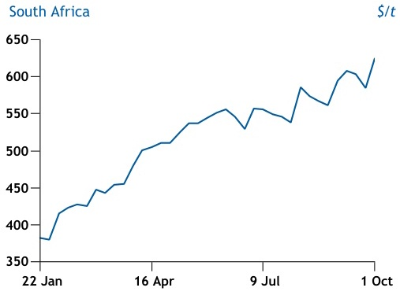
- Chart Title: South Africa
- Y-Axis: S/t
- Chart Type: line
|  | 22 Jan | 16 Apr | 9 Jul | 1 Oct |
| --- | --- | --- | --- | --- |
| item_01 | 375S/t | 425S/t | 550S/t | 625S/t |

Copyright Ⓒ 2021 Argus Media group
Licensed to: Shi Jia Lim, Argus Media Limited (London)

Page 11 of 22

argus

Argus Bitumen

Issue 21-39 I Friday 1 October 2021

ASIA-PACIFIC AND MIDDLE EAST MARKET COMMENTARY

# Singapore

Singapore bitumen prices edged up another $5/t this week,
supported by stronger deals and discussions among local
sellers and regional buyers.

On a fob Singapore basis, a key trader sold about 15,000t
in total to Indonesian buyers at $410/t for November-loading.
Several deals for October loading were also concluded at
about $405-410/t levels. Two more deals to be loaded in
end-October were also concluded into Vietnam on a cfr
basis, with fob values at $405-410/t.

Offers from refiners and local traders ranged at $415-
425/t for late-October/early-Nover loading cargoes that
met bids or buying indications in the $405-410/t range.

Supply from Singapore is expected to be more balanced
in October on the back of production loss from 2-3 key
refiners. The persistent negative spread between bitumen
and high-sulphur fuel oil (HSFO) could be pushing refiners to
incentivise production of HSFO versus bitumen.

Tank truck prices from Singapore have continued to rise
and were at $406-415/t ex-refinery. Demand in Malaysia has
been slowing again from the central region of Peninsular
Malaysia, following the recent pick-up.

Prices of tank trucks from Singapore jumped to around
$415-430/t ex-refinery. Regional players have also noted that
tighter bitumen supply across Singapore and Malaysia has
resulted in higher prices for tank trucks. An offer into Johore
was at around 1920 ringgit/t ($456/t) on a delivered basis.

Domestic prices in Singapore were raised by $20.50/t to
$420-445/t ex-tank for October on the back of higher crude
values in the past month. Domestic demand is expected
to however remain flat against September, with manpower
limitations and expected wet weather to hamper works.

Singapore pen 60/70 and HSFO cargoes $/t

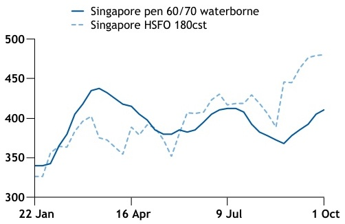
- Chart Type: bar
|  | 22 Jan | 16 Apr | 9 Jul | 1 Oct |
| --- | --- | --- | --- | --- |
| Singapore pen 60/70 waterborne | 35 | 37.5 | 425 | 455 |
| Singapore HSFO 180cst | 355 | 390 | 410 | 425 |

| Asia bitumen prices, 25 Sep-1 Oct |
| --- |
| <table><thead><tr><td rowspan="2"></td><td colspan="3">Local currency/t</td><td colspan="3">$/t</td></tr><tr><td>Low</td><td>High</td><td>±</td><td>Low</td><td>High</td><td>±</td></tr></thead><tbody><tr><td colspan="7">Domestic prices, ex-works</td></tr><tr><td>South Korea</td><td>605,268</td><td>628,958</td><td>+61,432.00</td><td>511</td><td>531</td><td>+51.00</td></tr><tr><td>Mumbai, India</td><td>40,270</td><td>43,970</td><td>+1,411.00</td><td>544</td><td>594</td><td>+17.00</td></tr><tr><td>Mumbai, India (drums)</td><td>37,070</td><td>39,870</td><td>+3,631.00</td><td>500</td><td>538</td><td>+46.50</td></tr><tr><td>Thailand</td><td>16,494</td><td>18,514</td><td>+484.50</td><td>490</td><td>550</td><td>+10.00</td></tr><tr><td>Indonesia</td><td>6,340,000</td><td>6,340,000</td><td>nc</td><td>444</td><td>444</td><td>-1.00</td></tr><tr><td>Singapore</td><td>570</td><td>604</td><td>+31.00</td><td>420</td><td>445</td><td>+20.50</td></tr><tr><td>Singapore-Malaysia ex-ref</td><td>570</td><td>584</td><td>+23.00</td><td>420</td><td>430</td><td>+14.50</td></tr><tr><td>Japan</td><td>63,513</td><td>71,619</td><td>+1,000.00</td><td>571</td><td>644</td><td>+0.50</td></tr><tr><td colspan="7">Waterborne, fob</td></tr><tr><td>Iran</td><td></td><td></td><td></td><td>290</td><td>305</td><td>+10.50</td></tr><tr><td>Iran (drums)</td><td></td><td></td><td></td><td>365</td><td>380</td><td>+16.00</td></tr><tr><td>Bahrain</td><td>160</td><td>160</td><td>nc</td><td>425</td><td>425</td><td>nc</td></tr><tr><td>Singapore</td><td>550</td><td>563</td><td>+9.50</td><td>405</td><td>415</td><td>+5.00</td></tr><tr><td>Singapore (drums)</td><td>699</td><td>712</td><td>+10.00</td><td>515</td><td>525</td><td>+5.00</td></tr><tr><td>Thailand</td><td>13,296</td><td>13,633</td><td>+283.00</td><td>395</td><td>405</td><td>+5.00</td></tr><tr><td>South Korea</td><td>467,869</td><td>479,714</td><td>+871.00</td><td>395</td><td>405</td><td>nc</td></tr><tr><td>Taiwan</td><td>11,120</td><td>11,259</td><td>+75.50</td><td>400</td><td>405</td><td>+2.50</td></tr><tr><td colspan="7">Waterborne, cfr</td></tr><tr><td>North China coast</td><td>2,714</td><td>2,811</td><td>-1.00</td><td>420</td><td>435</td><td>nc</td></tr><tr><td>East China coast</td><td>2,747</td><td>3,070</td><td>+16.00</td><td>425</td><td>475</td><td>+2.50</td></tr><tr><td>South China coast</td><td>2,908</td><td>3,005</td><td>+32.00</td><td>450</td><td>465</td><td>+5.00</td></tr><tr><td colspan="4">Northern Vietnam (drums)</td><td>428</td><td>548</td><td>+13.00</td></tr><tr><td colspan="4">Southern Vietnam (drums)</td><td>423</td><td>538</td><td>+8.00</td></tr><tr><td colspan="4">Economics</td><td></td><td>Mid</td><td>±</td></tr><tr><td colspan="4">Bitumen's value as fuel oil blendstock, Singapore</td><td></td><td>459.317</td><td>+2.23</td></tr></tbody></table> |
| <table><thead></thead><tbody><tr><td colspan="3">Asian Bitumen Price Index</td></tr><tr><td></td><td>Index</td><td>±</td></tr><tr><td>ABX 1 fob Singapore</td><td>410.00</td><td>+5.00</td></tr><tr><td>ABX 2 fob South Korea</td><td>400.00</td><td>nc</td></tr></tbody></table> |
| <table><thead></thead><tbody><tr><td colspan="4">Monthly Average (contract)</td></tr><tr><td>Contract</td><td></td><td>Sep 21</td><td>Aug 21</td></tr><tr><td>ABX 1</td><td></td><td>390.00</td><td>375</td></tr><tr><td>ABX 2</td><td></td><td>383.13</td><td>370</td></tr><tr><td colspan="4">Fob Mideast Gulf Price</td></tr><tr><td></td><td>Low</td><td>High</td><td>±</td></tr><tr><td>Mideast Gulf fob ($/t)</td><td>298</td><td>425</td><td>+5.50</td></tr></tbody></table> <table><thead></thead><tbody><tr><td colspan="4">Crude and refined products, 25 Sep-1 Oct</td></tr><tr><td></td><td>Low</td><td>High</td><td>±</td></tr><tr><td>Dubai fob Dubai $/bl</td><td>75.33</td><td>77.46</td><td>+2.94</td></tr><tr><td>Basrah Light fob Basrah $/bl</td><td>74.99</td><td>77.70</td><td>+2.73</td></tr><tr><td>Banoco Arab Medium $/bl</td><td>75.96</td><td>77.92</td><td>+2.79</td></tr><tr><td>Fuel oil HS 180cst fob Singapore $/t</td><td>479.75</td><td>486.75</td><td>+8.00</td></tr><tr><td>Fuel oil HS 380cst fob Singapore $/t</td><td>463.25</td><td>468.50</td><td>+14.25</td></tr><tr><td>Gasoil 0.5% fob Singapore $/bl</td><td>83.95</td><td>85.55</td><td>+4.45</td></tr></tbody></table> |

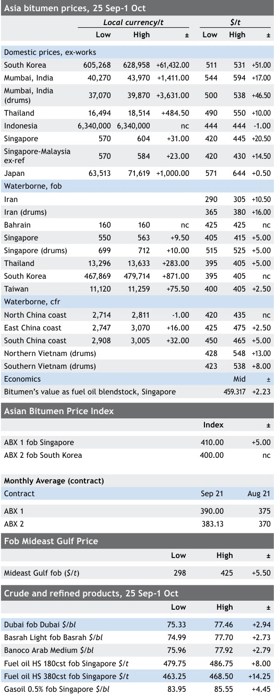

| Copyright Ⓒ 2021 Argus Media group Page 12 of 22 Licensed to: Shi Jia Lim, Argus Media Limited (London) | argus |
| --- | --- |

Argus Bitumen

Issue 21-39 I Friday 1 October 2021

# ASIA-PACIFIC AND MIDDLE EAST MARKET COMMENTARY

| Prices at China main refineries, 25 Sep-1 Oct | Prices at China main refineries, 25 Sep-1 Oct | Prices at China main refineries, 25 Sep-1 Oct | Prices at China main refineries, 25 Sep-1 Oct | Prices at China main refineries, 25 Sep-1 Oct | Prices at China main refineries, 25 Sep-1 Oct | Prices at China main refineries, 25 Sep-1 Oct | Prices at China main refineries, 25 Sep-1 Oct | Prices at China main refineries, 25 Sep-1 Oct | Prices at China main refineries, 25 Sep-1 Oct |
| --- | --- | --- | --- | --- | --- | --- | --- | --- | --- |
| Area | Province | Refinery | Grade | Contract price Yn/t | ± | Posted price Yn/t | ± | Contract price $/t | Posted price $/t |
| Northwest | Xinjiang | Petrochina Karamay | AH-70, AH-90, AH-110, AH-130 | 3,900 | nc | 4,300 | nc | 603 | 665 |
|  |  |  | AH-100, AH-140, AH-180 | 3,750 | nc | 4,050 | nc | 580 | 627 |
|  |  | Sinopec Tahe | 90-A | 3,075 | nc | 3,255 | nc | 476 | 504 |
|  |  |  | 90-B | 2,925 | nc | 3,205 | nc | 453 | 496 |
| Northeast | Liaoning | Petrochina Liaohe | AH-70, AH-90, AH-110, AH-100, AH-140 | 1,475 | nc | 1,875 | nc | 228 | 290 |
|  |  | Panjin Northern | AH-90, AH-110, AH-100, AH-140 | 2,500 | nc | 3,150 | nc | 387 | 487 |
| North | Hebei | Petrochina Qinhuangdao | AH-70, AH-90 | 3,250 | nc | 3,750 | nc | 503 | 580 |
| Central | Henan | Sinopec Luoyang | AH-90 | 2,935 | nc | 2,995 | nc | 454 | 463 |
| East | Shandong | CNOOC asphalt | AH-70, AH-90 | 2,680 | nc | 3,000 | nc | 415 | 464 |
|  |  | Sinopec Qilu | 70 -A | 3,725 | nc | 3,955 | nc | 576 | 612 |
|  |  |  | 90 -A, 70-B | 3,725 | nc | 3,955 | nc | 576 | 612 |
|  |  |  | 90-B | 3,525 | nc | 3,905 | nc | 545 | 604 |
|  | Zhejiang | Sinopec Zhenhai | 70-A, 90-A | 3,445 | +70 | 3,515 | +70 | 533 | 544 |
|  |  |  | 70-B, 90-B | 3,445 | +70 | 3,515 | +70 | 533 | 544 |
|  |  | Petrochina Wenzhou | AH-70, AH-90 | 3,190 | nc | 3,580 | nc | 494 | 554 |
|  | Shanghai | Sinopec Shanghai | AH-70 | 3,795 | +70 | 3,935 | +70 | 587 | 609 |
|  | Jiangsu | CNOOC Taizhou | AH-70, AH-90 | 3,150 | nc | 3,300 | nc | 487 | 511 |
|  |  | Sinopec Jinling | 70-A, 90-A | 3,565 | +20 | 3,645 | +20 | 552 | 564 |
|  |  | Petrochina Xingneng | 70-A, 90-A | 3,570 | nc | 3,940 | nc | 552 | 610 |
|  |  | Jangyin Alpha | 70-A, 90-A | 3,530 | nc | 3,850 | nc | 546 | 596 |
| South | Guangdong | Sinopec Maoming | 70-A, 90-A | 3,195 | +50 | 3,265 | +50 | 494 | 505 |
|  |  | Sinopec Guangzhou | 70-A, 90A | 3,335 | +50 | 3,395 | +50 | 516 | 525 |
|  |  | Petrochina Gaofu | AH-70, AH-90 | 4,040 | nc | 4,610 | nc | 625 | 713 |
| West | Sichuan | CNOOC Luzhou | AH-70, AH-90 | 3,530 | +230 | 3,530 | +230 | 546 | 546 |

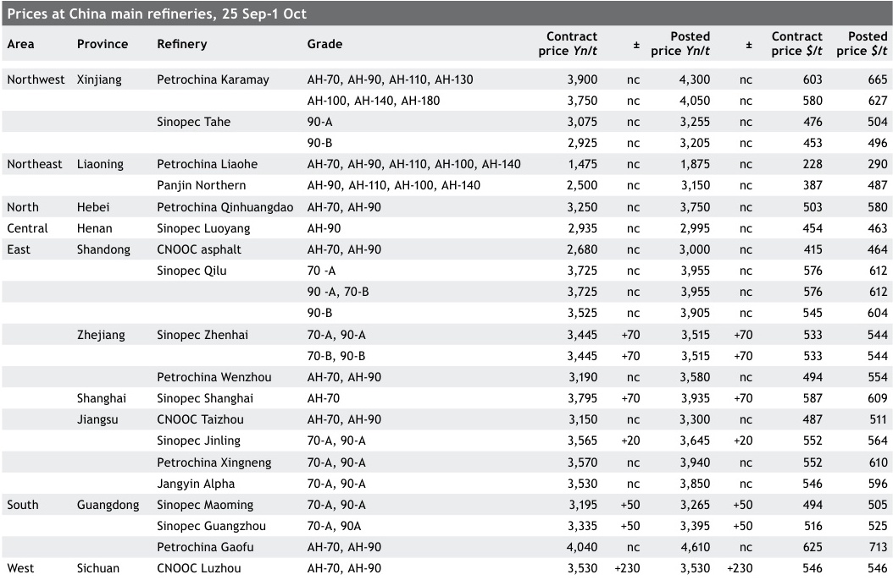

| Bitumen freight, 25 Sep-1 Oct | Bitumen freight, 25 Sep-1 Oct | Bitumen freight, 25 Sep-1 Oct | $/t |
| --- | --- | --- | --- |
| Singapore-east Australia | 130 | 145 | nc |
| Singapore-west Australia | 75 | 90 | nc |
| Singapore-Gresik, Indonesia | 32 | 38 | -0.50 |
| Singapore-north Vietnam | 45 | 50 | nc |
| Singapore-south Vietnam | 33 | 37 | -1.00 |
| Singapore-south China | 45 | 50 | nc |
| Singapore-east China | 50 | 60 | nc |
| Thailand-south China | 45 | 50 | nc |
| Thailand-east China | 50 | 55 | nc |
| Thailand-east Australia | 125 | 140 | +5.00 |
| Thailand-west Australia | 90 | 110 | nc |
| Taiwan-Ho Chi Minh, Vietnam | 40 | 45 | nc |
| Taiwan-Haiphong, Vietnam | 35 | 40 | nc |
| South Korea-east China | 30 | 35 | nc |
| South China-Haiphong, Vietnam | 30 | 35 | nc |

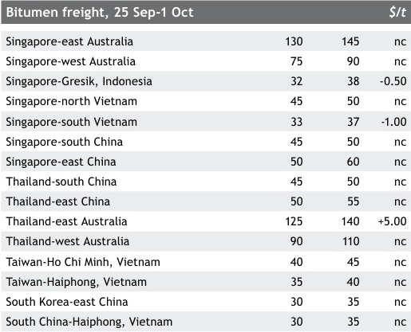

# Malaysia

Bitumen demand in Malaysia was stable-to-firm as most con-
struction projects across the country continued to operate
at a steady pace.

Demand from the Klang Valley continued to occupy a
large share of total volumes lifted, with bitumen demand
from ongoing projects and premix plants remaining firm over
the past three weeks.

The state-owned refiner increased its tank truck prices
to around 1,830-1,880 ringgit/t ex-Malacca ($437-449/t).
Prices from Port Klang rose similarly to around 1,870-1,900/t
ex-Klang ($447-454/t). Delivered prices in the north have
also edged up to around 1,870-1960 ringgit/t ($447-466/t) in
response an increase in listed prices from the state-owned
refiner's Prai facility.

Several players have expressed that erratic rainfall
over several construction sites has affected the progress
of projects, but demand across Peninsula Malaysia in the
coming months is expected to remain firm as most construc-
tion projects continue to edge towards completion by end
November.

# Thailand

Prices on a fob basis were assessed at $395-405/t in line
with the trend seen in Singapore.

Copyright Ⓒ 2021 Argus Media group
Licensed to: Shi Jia Lim, Argus Media Limited (London)

Page 13 of 22

argus

Argus Bitumen

Issue 21-39 I Friday 1 October 2021

ASIA-PACIFIC AND MIDDLE EAST MARKET COMMENTARY

A deal for a 2,000-3,000t cargo bound for central Viet-
nam, with a laycan period set in the first week of November,
was at around $395-400/t fob.

Regional traders have noted firmer buying indications
from Vietnamese buyers for end October and first half No-
vember-loading cargoes. Demand from Vietnam is expected
to pick up in November, as the seasonal monsoon ends.

Domestic demand for bitumen was mostly muted. Floods
across several regions in Thailand after tropical storm
Dianmu has hit operations in multiple construction sites in
Bangkok and other parts of central Thailand.

Domestic prices rose to around $490-550/t ex-refinery in
response to higher crude prices. The higher cost of produc-
tion has necessitated an increase in its listed prices.

# Indonesia

Bitumen demand in Indonesia continued to strengthen as the
country approached its annual peak season for the bitumen
market. Demand from the islands of Sumatra, Kalimantan
and Sulawesi continued to be relatively firm on the back of
ongoing projects.

A deal for a 1,500t Singapore origin cargo bound for
Kalimantan with a loading period set in first half October
was at above $430/t cfr Kalimantan. A 3,000t 1H October
loading cargo bound for North Sulawesi was concluded at
around $440/t cfr. Another deal for a 3,000t lot for first half
October loading to South Sumatra was concluded at around
$440/t cfr. A deal by a Singapore-based trader totalling up to
15,000t to be loaded across November and first half Decem-
ber was also done this week.

Buying ideas were in the $395-410/t fob range for end
October and early November loading cargoes. Most regional
players have continued to indicate their preference for

Delivered cargoes: North and South China

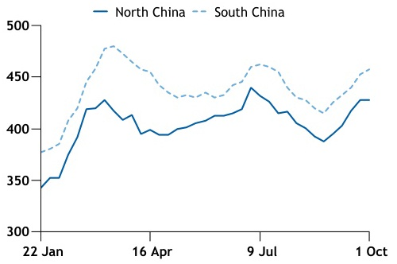
- Chart Type: bar
|  | 22 Jan | 16 Apr | 9 Jul | 1 Oct |
| --- | --- | --- | --- | --- |
| item_01 | 350Not explicitly visible | 475Not explicitly visible | 425Not explicitly visible | 450Not explicitly visible |

| Australia import cargo prices, 25 Sep-1 Oct | Australia import cargo prices, 25 Sep-1 Oct | Australia import cargo prices, 25 Sep-1 Oct | $/t |
| --- | --- | --- | --- |
|  | Low | High | ± |
| Thailand fob (Class 170) | 417 | 427 | +5.00 |
| Thailand fob (Class 320) | 422 | 432 | +5.00 |
| Singapore fob (Class 170) | 420 | 430 | +5.00 |
| Singapore fob (Class 320) | 425 | 435 | +5.00 |

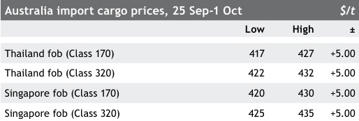

| Mideast Gulf to India freight rates | Mideast Gulf to India freight rates | Mideast Gulf to India freight rates | $/t |
| --- | --- | --- | --- |
|  | Low | High | ± |
| Bandar Abbas/ Nhava Sheva (drums) | 27 | 31 | nc |
| Bandar Abbas/ Mundra (drums) | 27 | 30 | nc |
| Bandar Abbas/ Haldia (drums) | 65 | 66 | nc |
| Bandar Abbas/ Mundra (bulk) | 80 | 85 | +2.50 |
| Bandar Abbas/ Karwar (bulk) | 85 | 90 | +2.50 |
| Bandar Abbas/ Kakinada (bulk) | 110 | 120 | nc |
| Bandar Abbas/ Haldia (bulk) | 120 | 130 | +5.00 |

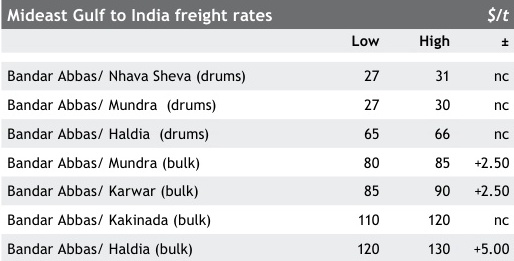

lifting from the state-owned refiner's terminals in Cilacap
and Gresik as an alternative compared with higher-priced
cargoes from regional markets.

# Vietnam

More deals and discussions surfaced in Vietnam as demand
firmed with the easing of lockdown. Some roadworks were
also hampered this week by the ongoing wet weather.

An importer concluded two October loading cargoes from
north Asia at $440-445/t cfr, with one small volume loading
for south Vietnam from Thailand and another 5,000t cargo to
north Vietnam.

Two 3,000t cargoes from Singapore were concluded at
$440/t cfr south Vietnam and $455/t cfr north Vietnam. This
could not be confirmed with the buyer. Freight costs were
estimated at $30-35/t to south Vietnam and $45-50/t to
north Vietnam.

An offer for an end-October loading cargo at $440/t cfr
was seen from a Singapore-based refiner, with the volume
and discharge ports yet to be fixed. The cargo was under-
stood to be part of a larger shipment heading towards the
north in end-October. Other offers into Vietnam for second-
half October volumes were ranging between $445-455/t cfr
for cargoes of both southeast Asian and northeast Asia ori-
gins, with most buying ideas at $440-445/t cfr. Discussions
for November volumes had yet to commence.

# South Korea

Prices in South Korea were unchanged on the back of limited
discussions or trades concluded.

Copyright Ⓒ 2021 Argus Media group
Licensed to: Shi Jia Lim, Argus Media Limited (London)

Page 14 of 22

argus

Argus Bitumen

Issue 21-39 I Friday 1 October 2021

ASIA-PACIFIC AND MIDDLE EAST MARKET COMMENTARY

| Iranian export sales through the IME, 25-30 Sep | Iranian export sales through the IME, 25-30 Sep | Iranian export sales through the IME, 25-30 Sep | Iranian export sales through the IME, 25-30 Sep | Iranian export sales through the IME, 25-30 Sep |
| --- | --- | --- | --- | --- |
| Grade | Seller | Price Rials/kg | Packing | Volume t Destination |
| Pen 60/70 | Jey Oil | 80,266-97,666 | Bulk & Drum | 17,000 Export by truck ex-Esfahan |
| Pen 60/70 | Jey Oil | 86,206 | Bulk | 8,000 Export by ship ex-Bandar Abbas |
| Pen 60/70 | Kasra Bitumen Refining | 95,486 | Drum | 4,200 Export by ship ex-Bandar Abbas |
| Pen 60/70 | Ace Oil | 76,289 | Bulk | 8,000 Export by ship ex-Bandar Abbas |
| Pen 60/70 | Petro Kala Hegmatan | 88,276 | Bulk | 5,000 Export by ship ex-Bandar Abbas |
| Pen 60/70 | RK Refining | 76,950 | Bulk | 600 Export by truck ex-Tabriz |
| Pen 40/50 | Hormozan Oil | 76,289 | Bulk | 1,500 Export by ship ex-Bandar Abbas |
| Pen 60/70 | Black Gold | 76,950-85,000 | Bulk & Drum | 3,000 Export by ship fob Bandar Abbas |
| Pen 60/70 | White Gold | 86,279-90,033 | Bulk & Drum | 2,000 Export by ship fob Bandar Abbas |
| AC40 | Bitumen Hormoz Pars | 81,685 | Bulk | 7,000 Export by ship ex-Bandar Abbas |
| Pen 60/70 | Pasargad Oil | 76,971 | Bulk | 2,000 Export by ship fob Bandar Lengeh |
| Pen 60/70 | Pasargad Oil | 76,950 | Bulk | 10,000 Export by ship ex-Bandar Imam Khomeini |
| Pen 60/70 | Pasargad Oil | 81,700 | Bulk | 5,000 Export by ship ex-Bandar Abbas |
| Pen 60/70 & 85/100 | Petro Pasargad Hormozgan | 86,279 | Bulk | 1,200 Export by ship fob Bandar Abbas |
| Pen 60/70 | Petro Ayegh Spadana | 76,950 | Bulk | 500 Export by truck ex-Esfahan |
| Pen 60/70, Ac40 | Siahfam | 80,871-90,033 | Bulk | 14,300 Export by ship fob Bandar Abbas |

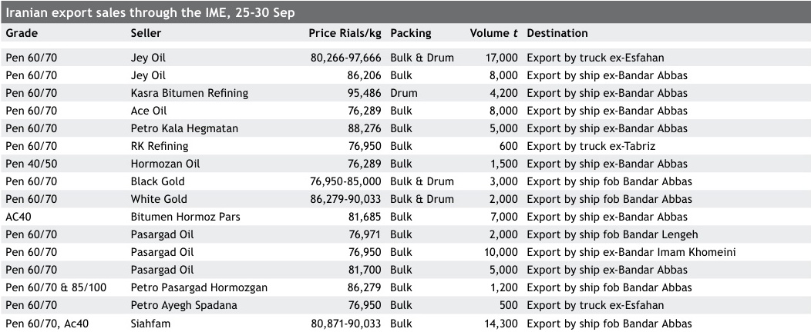

On a fob South Korea basis, no sell tenders were award-
ed. But a key refiner is expected to open a sell tender for
its November loading cargoes in the coming weeks. Demand
from China remains weak and is anticipated to remain a
bearish factor for the Korean sellers.

Meanwhile, some key refineries are continuing to produce
less bitumen on the back of strong HSFO economics. The
reduced physical volumes of bitumen has helped to balance
the overall supply availability for October.

Domestic prices in South Korea were raised by $51/t for
October, as recent firmness in crude values lent to higher
domestic selling prices. Demand outlook for October remains
slightly mixed, with local players wary of the recent spike
in Covid-19 cases following the Thanksgiving festival holiday
recently.

In Japan, domestic prices were raised by ¥1,000/t to
¥63,513-71,619/t ex-tank. Demand in September has been
mostly stable against the previous month. More roadworks
are expected to commence in October, though some proj-
ects might slow down with the upcoming general elections
in November. Some sellers were anticipating slightly tighter
supply in October, with one refiner's terminal in Yokohama
undergoing maintenance. This could not be confirmed.

# Taiwan

In line with regional price movements, export prices from
Taiwan were assessed $2.50/t higher to $400-405/t fob
Taiwan.

Volumes from the private refiner remain limited, with
no indications given on production levels for November and
December.

# Reduced volumes have also prompted buyers to seek
alternative cargoes of other origins.

Domestic prices from the state-owned refiner were un-
changed at NT17,000/t ex-tank.

# China

Limited negotiations were seen in China with the country
heading into the week-long break for Golden Week celebra-
tions from 1-7 October.

A key state-owned refiner raised its domestic listed
prices by 20-70 yuan/t for key refineries in east China and
by 50 yuan/t for refineries in the south. The upward revi-
sions were seen as mostly in line with the firmness in global
crude prices, with domestic demand expected to improve
post-Golden Week. Another smaller state-owned refiner
also raised listed prices by 230 yuan/t at its terminal in the
southwest.

Ongoing power shortages in parts of China had limited
impact on production. Some refineries in areas affected by
power shortages may have slowed the rate of production,
but supply levels were mostly unaffected.

A state-owned refinery in Shandong also resumed opera-
tions on 25 September after a planned turnaround. Two
refineries in the east and in the south are due to undergo a
month-long maintenance from October. Overall supply levels
are expected to remain ample with the refiner planning to
raise overall bitumen production by about 50,000-100,000t
in October. The planned increment comes on the back of re-
duced petroleum coke production which has been curtailed
due to carbon emission reduction plans.

Few discussions for imported cargoes were seen with

Copyright Ⓒ 2021 Argus Media group
Licensed to: Shi Jia Lim, Argus Media Limited (London)

Page 15 of 22

argus

Argus Bitumen

Issue 21-39 | Friday 1 October 2021

ASIA-PACIFIC AND MIDDLE EAST MARKET COMMENTARY

most buyers preferring to delay negotiations until after 8
October. In east China, an offer for an October-loading South
Korean cargo was at 3,250 yuan/t. About 7,000t of October-
loading cargo from South Korea were also concluded at
3,300-3,350 yuan/t to east China. This could not be con-
firmed. Another importer concluded a very prompt 5,000
South Korean cargo which loaded this week at $424/t cfr
east China.

In south China, no firm discussions for imports were
seen amid scant buying interest. An offer for November and
December-loading cargoes from a Singapore-based refiner
was made at $460/t cfr south China.

Higher freight rates were quoted for cargoes from South
Korea to east China, with ship owners having to contend
with higher demurrage fees due to ongoing port congestion,
particularly along the Yangtze River. Freight rates were at
$38-45/t for 5,000t cargoes, though few to no buyers were
willing to take the higher offers.

# Australia & New Zealand

In the state of Victoria, the ongoing construction sector
shutdown in Melbourne and other areas will be lifted from 5
October, with stringent Covid-19 measures in place. One sell-
er estimated a reduction of around 50pc of sales this week
due to the shutdown, with some slowdown also attributed
to the wet weather. Overall demand is expected to pick up
gradually in October and firm further in November.

Discussions were ongoing for November-loading cargoes,
with indicative offers at higher than current fob Singapore
levels. One importer also concluded a 7,000t cargo from
southeast Asia for loading mid-November on a formula basis.

In New Zealand, demand from Auckland is expected to
reach similar levels to the rest of the country gradually, with
roadworks picking up despite the city remaining under the
stricter "level 3" Covid-19 measures. Ullage levels remain
manageable with importers citing no need to delay or divert
incoming cargoes.

# India

In the Indian market, demand is slowly returning as the
monsoon is nearing its end. Roadworks are picking up slowly
in parts of the country with the monsoon expected to end in
another 10 days time.

Buying of bulk and drummed parcels from Iran picked up
this week but port inventories remain on the high side, thus
deterring a firm upturn. Local refiners also raised prices for
bulk by 1,600 Indian rupees/t and for drummed cargoes by
2,600 Indian rupees/t from 1 October.

Iranian Vacuum Bottom prices from NIOC*, 25-30 Sep

| Refinery | Volume t | Rials/kg | Rials/kg | $/t | $/t |
| --- | --- | --- | --- | --- | --- |
| Refinery | Volume t | Low | High | Low | High |
| Bandar Abbas | 20,000 | 78,699 | 78,999 | 289 | 290 |
| Esfahan | 10,000 | 74,878 | 75,044 | 275 | 275 |
| Shiraz | 10,000 | 75,244 | 75,244 | 276 | 276 |
| Tehran | 20,000 | 75,119 | 76,890 | 276 | 282 |
| Tabriz | 8,000 | 71,661 | 71,661 | 263 | 263 |
| Abadan | 20,000 | 71,661 | 74,999 | 263 | 275 |
| Arak | 15,000 | 74,007 | 74,958 | 272 | 275 |

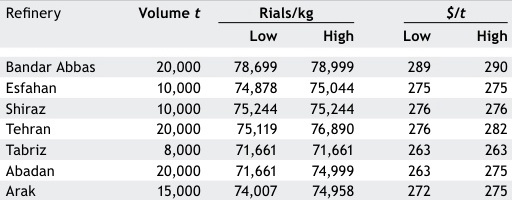

· Exclusive of the 9pc tax for domestic sales and 14pc duty for export sales

# Iranian domestic sales through the IME, 25-30 Sep

| Grade | Volume t | Price rials/kg |
| --- | --- | --- |
| 60/70 | 2,798 | 78,000-83,500 |
| 85/100 | 55 | 79,858 |
| Emulsion | 25 | 74,000 |
| 40/50 | 0 |  |
| PG6416-PG5816-PG5822 | 1,405 | 79,858 |
| MC250 | 25 | 110,000 |

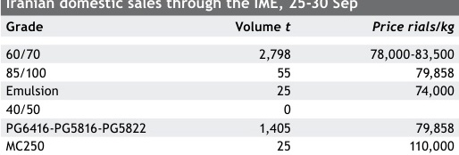

# Bahrain

Bahrain's state-owned refiner will be increasing its bitumen
listed prices by $15/t with effect from 2 October on the back
of the recent hikes in crude and fuel oil prices. This price
hike will see listed prices increase to $440/t fob Sitra.

This is the third time in a month where the refiner has
announced a price increase.

# Iran

The Iranian market firmed supported by higher VB feed
prices and improved demand. The exchange rate fluctuated
in the 233,000-273,000 rials range on the local platforms.
Bulk prices were assessed at $290-305/t fob Bandar Abbas.
Bulk cargoes from Bandar Imam Khomeini port were offered
at $285-290/t fob.

A 5,000t VG40 bulk lot was sold at $292/t fob Bandar
Abbas to India for prompt delivery. A 4,000t bulk cargo was
sold at $287/t to India. A 6,000t vessel size cargo was sold
at $290/t to India for prompt delivery. A total 9,000t of bulk
cargoes were loaded based on previous contracts at $285/t
fob.

Demand remained firm for bulk to Pakistan with at
least 10,000t sold at 81,000-82,000 rials/kg (about $300/t)
ex-Esfahan, up 3,000 rials/kg week-on-week. Demand from
Afghanistan remained subdued.

Demand for drums was boosted in the past week and
prices were assessed at $365-375/t on different payment
terms. Buying interest for drums from India increased as

Copyright Ⓒ 2021 Argus Media group
Licensed to: Shi Jia Lim, Argus Media Limited (London)

Page 16 of 22

argus

Argus Bitumen

Issue 21-39 | Friday 1 October 2021

ASIA-PACIFIC AND MIDDLE EAST MARKET COMMENTARY

demand is slowly firming, amid thin supply of Iraqi drums.
A producer sold 10,000t in drums at $365-367/t to Sri Lanka
and India. A total 10,000t of pen 60/70 in drums traded at
$365-367/t to Bangladesh, Sri Lanka and India on cash pay-
ment basis.

Total 2,000t were sold at $375/t for October laycan to
east Africa. A 5,000t Jey-embossed cargo sold at $373-376/t
fob, while several small cargoes were sold at $365-370/t to
Tanzania, Sri Lanka, India, Bangladesh and the UAE. A total
5,000t in drums sold at $415-420/t cfr Turkmenistan for
prompt delivery, with freight and logistic charges estimated
at $65/t.

Private shipping companies imposed a new General Rate
Increase (GRI) for transshipment cargoes from Jebel Ali at
an average $100/container ($5/t) from 26 September. In ad-
dition to this, direct shipments from Iran to Kenya rose from
$1,550/container to $1,850/container from this week,while
no container was available by IRISL for exporters.

Jumbo bag prices remained stable at $350-360/t, but
demand was thin due to the low gap with drum cargoes.
Iraqi bitumen supply has weakened over the past month and
a major producer was offered drum cargoes at $355-360/t,
while a 10,000t drum cargo was sold at $335-340/t early
this week to Myanmar and India. Market players said Iraqi
vacuum residue (VR) feed price rose sharply and availability
of VR in north Iraq fell sharply and several bitumen produc-
ers in Kurdistan region has halted production.

On the IME, prices moved up as competition rose be-
tween buyers. Jey Oil sold 8,000t of pen 60/70 in bulk at
86,206 rials/kg ($316/t) ex-Bandar Abbas, up by $10/t. Jey
Oil also sold 7,000t at 80,350 rials/kg ($294/t)ex-Esfahan, up
around 3,900 rials/kg week-on-week and 10,000t in drums
were sold at 93,009-97,666 rials/kg ($341-358/t) ex-Esfahan.

Pasargad Oil increased prices to around 4,050 rials/
kg ($14/t) and sold 5,000t bulk on 81,700 rials/kg ($300/t)
ex-Bandar Abbas. Another 2,000t in bulk was sold at 76,961
rials/kg ex-Arak refinery, while 10,000t bulk of pen 60/70
sold at 76,950 rials/kg ($283/t) ex-Abadan.

# Iran local market

VB feed prices continued on an upward trend as the Oil Re-
fining Industry Association (Orica) revised VB feed prices on
25 September. VB feed prices from Bandar Abbas and Shiraz
Refineries were announced at 75,244 rials/kg, up by 4,970
rials/kg ($18/t) and from other refineries at 71,661 rials/kg,
up by 4,733 rials/kg ($17.5/t).

But buying interest was healthy due to lowered VB sup-

ply by refineries and expectations of further rise in prices
in the coming revision, led by hikes in crude and HSFO
prices. About 202,000t demand registered for VB feed, while
103,000t was sold by refineries on IME this week.

Bandar Abbas refinery announced a planned maintenance
for a month from mid-October. VB feed supply from Bandar
Abbas refinery is likely to drop by 50pc from this week until
the end of November. Bandar Abbas Refinery offered 20,000t
of VB feed at 75,244 rials/kg and 71,000t demand was regis-
tered. They finally sold 20,000t at an average of 78,919 rials/
kg.

Tehran Refinery may also undergo maintenance from
mid-October and likely will reduce VB feed supply too.
Tehran Refinery sold 20,000t of VB feed at 75,421 rial/kg, up
by 4,000 rials/kg ($14.50/t). Esfahan Refinery sold 10,000t
at 75,004 rials/kg, up by 4,000 rials/kg ($14.50/t). Tabriz
Refinery sold 8,000t at 71,616 rials/kg, up by 3,100 rials/kg.
Abadan Refinery sold 20,000t at 71,661-74,999 rials/kg. Arak
Refinery sold 25,000t at 74,570 rials/kg, up by about 6,000
rials/kg. Shiraz Refinery sold 10,000t at 75,244 rials/kg, up
by about 3,000 rials/kg.

Bitumen prices rose in the domestic market, following a
surge in VB feed prices and producers sold 4,308t of differ-
ent products at 74,000-110,000 rials/kg on IME.

# Proposal to change waterborne fob Singa-
pore assessment

Argus proposes to change the laycan timing of its
waterborne fob Singapore assessment from the current
30-40 days forward to 15-40 days forward from the date
of publication. Argus also proposes to change the cur-
rent cargo sizes in the fobB Singapore assessment from
3,000-5,000t to 3,000-7,000t.

Argus will accept comments on this proposed change
until 20 October 2021. To discuss this proposal, please
contact the Asia Bitumen editor, Mahua Chakravarty, at
mahua.chakravarty@argusmedia.com or by phone on +65
6496 9935. Formal comments should be marked as such
and may be submitted by email to mahua.chakravarty@
argusmedia.com or by post to Mahua Chakravarty, Argus
Media, 50 Raffles Place, #10-01 Singapore Land Tower,
Singapore 048623, and received by 20 October 2021.
Please note that formal comments will be published
after the consultation period unless confidentiality is
specifically requested.

Copyright Ⓒ 2021 Argus Media group
Licensed to: Shi Jia Lim, Argus Media Limited (London)

Page 17 of 22

argus

Argus Bitumen

Issue 21-39 I Friday 1 October 2021

VESSEL TRACKING INDICATIONS

| Bitumen freight movements | Bitumen freight movements | Bitumen freight movements | Bitumen freight movements | Bitumen freight movements | Bitumen freight movements | Bitumen freight movements |
| --- | --- | --- | --- | --- | --- | --- |
| Vessel name | Owner | Tonnage | Loading port | Discharge port | Current position | ETA |
| San Biagio | ABC Maritime | 4,900 | Abidjan | Douala, Cameroon | WAF | 29-Sep |
| Bitonia | Frederi Beta | 4,972 | Hamburg | Akureyri, Iceland | Northwest Europe | 29-Sep |
| Iver Ability | HB Tankship | 12,497 | Hamburg | Thames, UK | Northwest Europe | 27-Sep |
| Ning Hai Wan | Ninghaiwan Maritime Co Ltd | 6,118 | Huelva | Donges, France | Northwest Europe | 29-Sep |
| San Bacco | ABC Maritime | 4,995 | Brunsbuettel | Sodertalje, Sweden | Northwest Europe | 28-Sep |
| Iver Brilliant | HB Tankship | 6,239 | Liepaja | Newport, Wales | Northwest Europe | 3-Sep |
| Iver Agile | Petrolmar SPA | 5,765 | Mersin | Alexandria, Egypt | Med | 2-Oct |
| Iver Action | HB Tankship | 5,897 | Augusta | Lavera, France | Med | 2-Oct |
| Sunpower | Queensway Navigation | 4,999 | Aspropyrgos | Mangalia, Romania | Black Sea | 3-Oct |
| Xing Hai Wan | COSCOSAS | 6,123 | Rotterdam | Bayonne, France | Northwest Europe | 2-Oct |
| Acacia Rubra | White Flag Ventures | 6,065 | Lomonosov | Pori, Finland | Baltic Sea | 30-Sep |
| Bitflower | Tarbit Shipping | 6,314 | Rotterdam | Nantes, France | Northwest Europe | 1-Oct |
| Iver Bitumen | WS Tankship | 6,586 | Huelva | Tenerife, Spain | Med | 1-Oct |
| Iver Accord | HB Tankship | 5,897 | La Coruna | Blaye, France | Northwest Europe | 1-Oct |
| R Ocean | R ROSE TRADING COMPANY | 3,764 | Basrah | Mombasa, Kenya | Arabian Sea | 10-Oct |
| Herbania | DMG | 7,066 | Huelva | Ghazaouet, Algeria | Med | 29-Sep |
| Poestella | Bilsea | 8,021 | Augusta | Algiers, Algeria | Med | 2-Oct |
| Seapower | Nanjing Petroleum T'ptn | 4,999 | St Petersburg | Tallinn, Estonia | Baltic Sea | 1-Oct |
| An Hai Wan | COSCOSAS | 6,165 | Tarragona | Naples, Italy | Med | 2-Oct |
| Iver Balance | HB Tankship | 6,180 | Cadiz | Oran, Algeria | Med | 30-Sep |
| LG Asphalt 1 | LG Asphalt | 2,107 | Singapore | Semarang, Indo- nesia | Java Sea | 2-Oct |
| Lilstella | Bilsea | 7,944 | Singapore | Qinzhou, China | Java Sea | 4-0ct |
| Da Kun Shan | UNITED BRIGHT MARITIME LTD | 6,186 | Singapore | Qinzhou, China | Java Sea | 3-Oct |
| Peng Hu Wan | COSCOSAS | 6,327 | Yeosu | Nanjing, China | Nanjing | 1-Oct |
| VP Asphalt 1 | VP Petrochemical | 3,102 | Rayong | Cam Ranh, Vietnam | Vietnam | 2-Oct |
| Bitumen Shouri | Kallex | 3,638 | Singapore | Tan Hiep, Vietnam | Malacca Strait | 2-Oct |
| Black Dragon | Itochu | 2,500 | Ulsan | Mutsure, Japan | Japan | 28-Sep |
| Black Jade | National Bitumen Corporation | 5,500 | Ulsan | Lanshan, China | East China Sea | 30-Sep |
| Tai Hua Wan | Cosco Shipping | 7,652 | Singapore | Qinzhou, China | Vietnam | 2-Oct |
| Kang Hua Wan | Cosco | 7,651 | Yeosu | Ningbo, China | Zhejiang | 28-Sep |

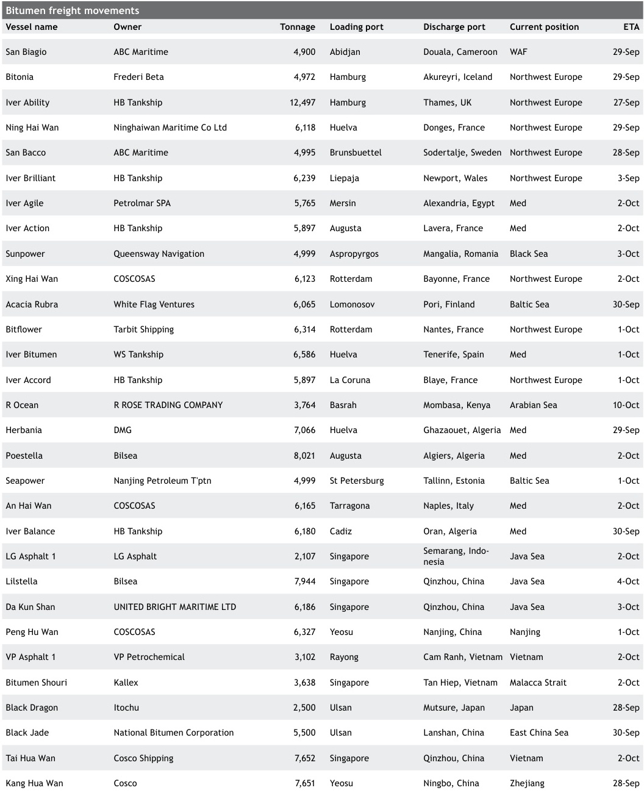

Copyright Ⓒ 2021 Argus Media group Page 18 of 22
Licensed to: Shi Jia Lim, Argus Media Limited (London)

argus

Argus Bitumen

Issue 21-39 | Friday 1 October 2021

NEWS

Narrow margins pressure Iran's bitumen

Iranian bitumen production fell by an estimated 22pc during
March-August, faced by the double whammy of higher costs
of production and weak demand from key markets.

Iran's VB feed sales volume fell by about 22pc from
2.962mn t to 2.314mn t between 22 March and 22 August
2021 compared with the same period last year. As a result,
bitumen production also fell by at least about 22pc during
the same period.

Meanwhile, bitumen sellers have seen weak demand in
domestic as well as regional markets. Producers have also
seen an increasing squeeze on margins on the rising cost of
VB feed prices. This, coupled with stronger high-sulphur fuel
oil (HSFO) economics, has resulted in higher production of
fuel oil and has reduced export volumes.

"We reduced trading activities for bitumen as there is
no profit margin, and have switched to other products," said
several local traders.

"As a producer, we have faced losses over the past
months and were forced to sell our cargoes only to pay our
debts from purchasing VB feed that was bought earlier," said
several producers.

As a result, the number of companies trading or selling
bitumen within Iran has fallen over the past few months.

A gap was seen in buy-sell expectations as higher offers
based on higher costs of production were rejected by buy-
ers from key markets. This was further underpinned by the
impact of Covid-19, which resulted in issues with government
funds and slowed paving activities in recent months.

"We purchased VB feed at 70,274 rials/kg [$285/t] and
produced bitumen at $315/t fob, including storage and VAT
costs, but we have sold without any profit," said industry
participants. The government did not give a tax rebate to

Singapore and Rayong waterborne

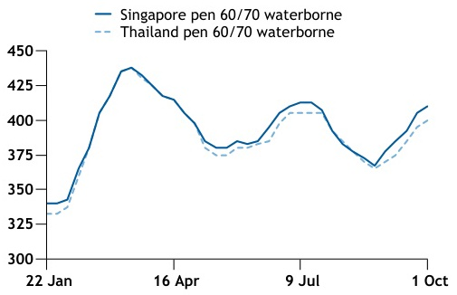
- Chart Type: line
|  | 22 Jan | 16 Apr | 9 Jul | 1 Oct |
| --- | --- | --- | --- | --- |
| item_01 | 325 | 425 | 400 | 375 |

# many exporters in the past two years and imposed a bitu-
men export tax from March 2021 onwards.

VB feed supply fell by 21pc from 3.24mn t to 2.56mn t
between 22 March and 22 August this year. This was sup-
ported by a possible move by Iranian refineries to increase
fuel oil production because of higher demand, in contrast to
weak demand from bitumen producers.

On the other hand, Iran's bitumen exports in August slid
by 32pc compared with a month earlier and was 48pc lower
year-on-year amid low demand from Asian markets. Exports
fell to about 221,730t in August, down from 326,000t sold
in July. Meanwhile Iran's export sales stood at 431,000t in
August 2020, according to data from the Iran Mercantile
Exchange.

# Vietnam's bitumen demand to rise

Bitumen demand from Vietnam looks set to increase in the
next few years, supported by an ambitious road develop-
ment plan that seeks to construct over 5,000km of express-
ways between 2021-2030.

The Road Network Development Plan which was unveiled
this month seeks to develop over 5,000km of expressways in
the country by 2030, up from 3,841km in 2021.

Key areas for expressway development include exten-
sions to the ongoing North-South Expressway project, as well
as the 14 expressways in the north, which alone would total
about 2,305km. It also includes 10 expressways making up
around 1,431km in the central and central highlands region,
and another 10 expressways totalling around 1,290km in the
south.

On top of the new additions to the expressways, there
are also plans for 172 national highway routes totalling

t

Argus successfully completes annual losco
assurance review

Argus has completed the ninth external assurance
review of its price benchmarks covering crude oil,
products, LPG, petrochemicals, biofuels, thermal coal,
coking coal, iron ore, steel, natural gas and biomass
benchmarks. The review was carried out by profes-
sional services firm PwC. Annual independent, external
reviews of oil benchmarks are required by international
regulatory group losco's Principles for Oil Price Report-
ing Agencies, and losco encourages extension of the re-
views to non-oil benchmarks. For more information and
to download the review visit our website https://www.
argusmedia.com/en/about-us/governance-compliance

Copyright Ⓒ 2021 Argus Media group
Licensed to: Shi Jia Lim, Argus Media Limited (London)

Page 19 of 22

argus

Argus Bitumen

Issue 21-39 I Friday 1 October 2021

NEWS

29,795km by 2030, and 3,034km of coastal roads spanning 28
cities and provinces.

The road development plan is one of the five master
blueprints for the country's transport sector, which include
plans for high-speed rail routes, sea ports and new inter-
national airports to be constructed between this year and
2030. The investment capital for the plan is estimated to be
about 900,000bn dong ($39.6bn), according to a draft issued
by Vietnam's Ministry of Transport. The bulk of the project
funding is expected to come from public-private partnership
(PPP) investment.

The Vietnamese government had in January this year

# Argus Consulting
Services

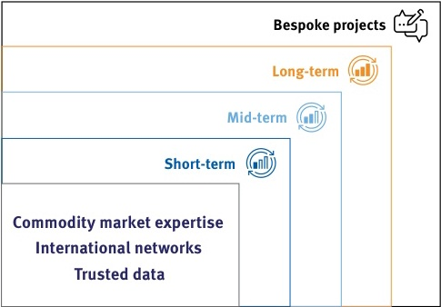
Bespoke projects
Long-term
Mid-term
Short-term
Commodity market expertise
International networks
Trusted data

- Chart Type: bar
|  | Bespoke projects | Long-term | Mid-term | Short-term |
| --- | --- | --- | --- | --- |
| item_01 | 0Not specified | 1Not specified | 0Not specified | 0Not specified |

# Providing clients with:

- ● Business strategy support
- ● Access to the local and global energy
- commodity market
- · Customized market analysis
- · Supply and demand, trade and price forecasts
- · Training

Click here to find out more 》

unveiled a new PPP framework to support the country's
development plans, where investors of projects in transpor-
tation, healthcare, education, power transmission and water
sectors can receive benefits such as tax reductions or credit
support, among others.

Vietnam does not produce bitumen, which is used in
road construction. The country imported close to 890,000t
of bitumen in 2020, the highest in the last five years. New
road construction projects are expected to continue as the
government pushes for infrastructure development in tan-
dem with economic goals, and has positioned Vietnam as an
attractive business hub.

The road development plan is also aligned with Vietnam's
11th Socio-Economic Development Plan (SEDP), which covers
the period of 2021-2025 and includes the goal of achieving
an average Gross Domestic Product (GDP) of 6.5-7pc in the
next five years.

# Ghana's new bitumen terminal delayed

Ghanaian state-owned oil and gas marketing firm Goil has
pushed back the completion date for a new $35mn bitumen
terminal and conversion project at the port of Tema to the
end of this year.

The 6,000t terminal - which will supply imported AC-10
and AC-20 bitumen performance grades to newly built poly-
mer-modified bitumen (PMB) and bitumen emulsions plants
- had been slated for completion by the end of this month.
Covid-related issues are understood to be partly responsible
for the delay.

Goil's joint venture partner in the project is Ivory Coast
bitumen producer and exporter SMB, which has 300,000 t/yr
of bitumen production capacity at its Abidjan refinery. The
project was announced in 2017 and construction work began
two years later. It is now 94pc complete.

Once operations start, bitumen imports into Tema will be
fed to the terminal by a 3km pipeline, which will be electri-
cally heated to keep the road paving product liquid before it
is discharged into Goil's newly built storage tanks.

The imported bitumen will then feed into the styrene-
butadiene-styrene PMB plant, which will have the capacity
to produce 30 t/hour. Some local market participants expect
increased use of PMB in major road and highway projects in
Ghana over the coming years.

One domestic construction sector player said its use had
yet to be pursued aggressively by the country's highways au-
thorities. The bitumen emulsions plant will have a capacity
of 60 t/hr. Bitumen emulsions are already in much wider use
in Ghana than PMB.

Copyright Ⓒ 2021 Argus Media group
Licensed to: Shi Jia Lim, Argus Media Limited (London)

Page 20 of 22

argus

Argus Bitumen

Issue 21-39 I Friday 1 October 2021

NEWS

Germany's Schwedt refinery completes restart

German refinery consortium PCK has completed the restart
of its 208,000 b/d Schwedt refinery in north eastern Ger-
many.

The plant is ramping up production in order to reach a
80-100pc utilisation rate. Repair works on a high conversion
soaker cracking (HSC) unit will last until mid-October, ac-
cording to one of the refinery's shareholders.

The PCK consortium comprises Russia's state-controlled
Rosneft, Shell and Italian energy firm Eni.

The facility was shut down by a regional electricity
failure on 8 September. PCK began restart operations on the
same day, but warned at the time that the process would
take several days.

# Bahrain's Bapco raises bitumen prices by $15/t

Bahrain's state-owned refiner Bapco will increase its bitu-
men listed prices by $15/t from 2 October on the back of
higher crude and fuel oil prices.

This price hike will see listed prices increase to $440/t
fob Sitra. This is the third time in a month Bapco has an-
nounced a price increase. It raised listed prices by $20/t
on two occasions, first on 11 September and again on 19
September.

Hikes in high-sulphur fuel oil (HSFO) prices have prompt-
ed regional refiners to switch to producing HSFO over bitu-
men.

Romania's Midia refinery back to 'optimal'

Repairs at Romania's 100,000 b/d Midia refinery, in Navodari
on the Black Sea coast, have been largely completed, with
operations scheduled to return to "optimal" levels by the
end of October, Kazakh-owned operator Rompetrol Rafinare
said.

# The refinery had been offline since early-July because of
a fire, which killed three people and injured two others.

Rompetrol Rafinare is performing the last technical
checks to resume production and Midia's installations will be
restarted in stages. The operator of the refinery said that
it is currently in the phase of starting up petrol and diesel
production units.

Midia was previously expected to start on 20-24 Septem-
ber. The plant already supplied some raw material to Rom-
petrol Rafinare's Vega bitumen plant in Ploiesti last week,
suggesting some units were operating, but the operator
declined to say whether the restarting process began then.

Midia's diesel hydrotreatment unit, where the fire broke
out in July, has been "technologically isolated" and its re-
pairs and restart is scheduled for 2022, the company said.

The fire also affected the kerosene hydrotreater and
catalytic reformer units, along with nearby pipes connected
to the naphtha hydrotreater and saturated gases units, the
company said last month.

# BTK's bitumen terminal to be upgraded

Bunkering company Baltic Fuel (BTK) has secured Rbs1bn
($14mn) of financing for a two-phase project to increase
bitumen loadings at its Turukhtannye Ostrova terminal at St
Petersburg port.

BTK subsidiary Kontur reached a six-year loan agreement
with St Petersburg Bank for the project, which aims to add
43,800m3 of storage and increase loading capacity for bitu-
men and vacuum residue - a feedstock for bitumen produc-
tion - as well as providing facilities to manufacture polymer-
modified bitumen. Turukhtannye Ostrova has capacity to
handle about 1.8mn t/yr of products, mainly fuel oil and
gasoil, and more than 80,000m3 of tank-farm space - around

The Effects of Coronavirus on Markets
> Blog posts
> Podcasts
> News stories
> White Papers
> Webinars
> and more
View the Argus hub page >>>

# North Sea Dated diff Maya

$/bl

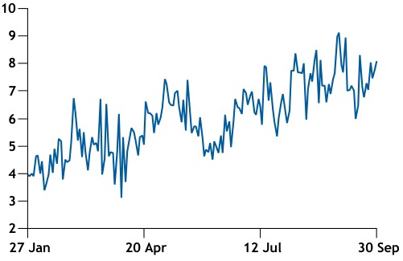
- Chart Type: line
|  | Jan | Feb | Mar | Apr | May | Jun | Jul | Aug | Sep | Oct | Nov | Dec |
| --- | --- | --- | --- | --- | --- | --- | --- | --- | --- | --- | --- | --- |
| item_01 | 4 | 5 | 6 | 5 | 6 | 7 | 5 | 6 | 7 | 8 | 9 | 8 |

Copyright Ⓒ 2021 Argus Media group
Licensed to: Shi Jia Lim, Argus Media Limited (London)

Page 21 of 22

argus

Argus Bitumen

Issue 21-39 I Friday 1 October 2021

NEWS

500,000 t/yr of terminal capacity is dedicated to bunkering
operations. Turukhtannye Ostrova began loading bitumen
in September last year - it shipped 64,000t in January-July
and 20,300t in the final four months of 2020. The product
loads in 4,000-6,000t cargoes at berth SV-15. Trading firm
Vitol buys all bitumen shipped from Turukhtannye Ostrova.

Argus direct
Web | Mobile | Alerts

Argus Direct provides immediate
access to market moving news,
intelligent analysis and robust
price assessments, wherever.

www.argusmedia.com/ direct

# Argus Bitumen Methodology

Argus uses a precise and transpar-
ent methodology to assess prices
in all the markets it covers. The
latest version of the Argus Bitumen
Methodology can be found at:
www.argusmedia.com/methodology

For a hard copy, please email
info@argusmedia.com, but
please note that methodologies
are updated frequently and for
the latest version, you should
visit the internet site.

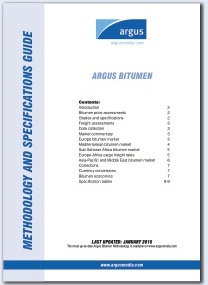
GUIDE argus
SPECIFICATIONS
ARGUS BITUMEN
bluner maries
AND
Mestageon
PerMook Can
METHODOLOGY LAST SPENITE JANKART2015
unigin
www.argmts.com

argus

Argus Bitumen is published by Argus Media group

# Registered office

Lacon House, 84 Theobald's Road,
London, WC1X 8NL
Tel: +44 20 7780 4200
email: sales@argusmedia.com

# ISSN: 2057-6749

# Copyright notice

Copyright Ⓒ 2021 Argus Media group

All rights reserved
All intellectual property rights in this publica-
tion and the information published herein are the
exclusive property of Argus and/or its licensors
(including exchanges) and may only be used under
licence from Argus. Without limiting the foregoing,
by accessing this publication you agree that you will
not copy or reproduce or use any part of its contents
(including, but not limited to, single prices or any
other individual items of data) in any form or for
any purpose whatsoever except under valid licence
from Argus. Further, your access to and use of data
from exchanges may be subject to additional fees
and/or execution of a separate agreement, whether
directly with the exchanges or through Argus.

# Petroleum

illuminating the markets

Trademark notice

ARGUS, the ARGUS logo, ARGUS MEDIA, INTEGER,
ARGUS BITUMEN, other ARGUS publication titles
and ARGUS index names are trademarks of Argus
Media Limited.
Visit www.argusmedia.com/Ft/trademarks for
more information.

Disclaimer

The data and other information published herein
(the "Data") are provided on an "as is" basis.
Argus and its licensors (including exchanges)
make no warranties, express or implied, as to the
accuracy, adequacy, timeliness, or completeness
of the Data or fitness for any particular purpose.
Argus and its licensors (including exchanges) shall
not be liable for any loss, claims or damage arising
from any party's reliance on the Data and disclaim
any and all liability related to or arising out of use
of the Data to the full extent permissible by law.

All personal contact information is held and used
in accordance with Argus Media's Privacy Policy
http://www.argusmedia.com/en/privacy-policy

Publisher
Adrian Binks

Chief operating officer
Matthew Burkley

Customer support and sales:
support@argusmedia.com
sales@argusmedia.com

Global compliance officer
Jeffrey Amos

Chief commercial officer
Jo Loudiadis

President, Oil
Euan Craik

Global SVP editorial
Neil Fleming

Editor in chief
Jim Washer

Managing editor
Andrew Bonnington

Editor
Jonathan Weston
Tel: +44 20 7199 5779
bitumen@argusmedia.com

London, Tel: +44 20 7780 4200
Beijing, Tel: +86 10 6598 2000
Dubai, Tel: +971 4434 5112
Hamburg, Tel: +49 48 22 378 22-0
Houston, Tel: +1 713 968 0000
Kyiv, Tel: +38 (044) 298 18 08
Moscow, Tel: +7 495 933 7571
Mumbai, Tel: +91 22 4174 9900
New York, Tel: +1 646 376 6130
Paris, Tel: +33 1 53 05 57 58
San Francisco, Tel: +1 415 829 4591
Sao Paulo, Tel: +55 11 3235 2700
Shanghai, Tel: +86 21 6377 0159
Singapore, Tel: +65 6496 9966
Tokyo, Tel: +81 3 3561 1805
Washington, DC, Tel: +1 202 775 0240

INVESTORS
IN PEOPLE

THE QUEEN'S AWARDS
FOR ENTERPRISE:
2015

Licensed to: Shi Jia Lim, Argus Media Limited (London)